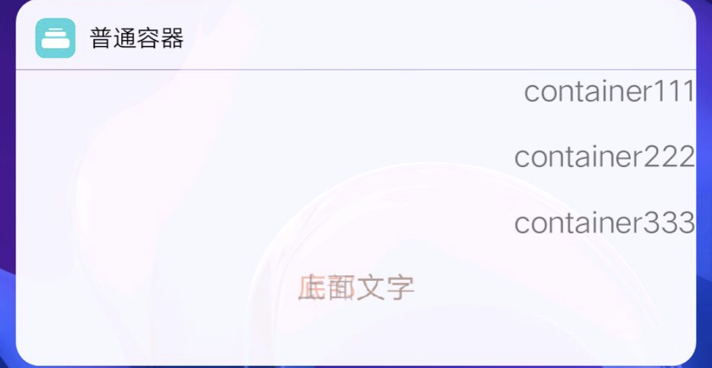

## 容器组件 container

### 描述

用于约束组件之间布局关系

### 使用效果




### 使用方法

在`.ux`文件中引入组件

```html
<import name="v-container" src="vivo-cards-suits/components/container/index"></import>
```

### 示例

```html
<template>
  <div class="wrap">
    <v-container height="300" opacity="1" justify="space-between" align="right">
      <text>container111</text>
      <text>container222</text>
      <text>container333</text>
      <v-container
        height="100"
        opacity="0.5"
        justify="space-around"
        align="left"
        stack="{{true}}"
      >
        <text style="color: coral;">container111</text>
        <text>container222</text>
      </v-container>
    </v-container>
  </div>
</template>
```

### API

#### 组件属性

| 属性    | 类型    | 默认值 | 说明                                                         |
| ------- | ------- | ------ | ------------------------------------------------------------ |
| height  | String  | ''     | 组件高度                                                     |
| width   | String  | '100%’ | 组件宽度                                                     |
| opacity | Number  | 1      | 组件透明度                                                   |
| bgColor | String  | ''     | 组件背景色                                                   |
| justify | String  | 'top'  | 垂直对齐方式，可选值：'top','bottom','center','space-around','space-between' |
| align   | String  | 'left' | 水平对齐方式，可选值：'left','center','right'                |
| stack   | Boolean | false  | 是否为层叠容器                                               |

#### slot

| 名称 | 描述     | 返回值 |
| ---- | -------- | ------ |
| -    | 容器内容 | -      |

