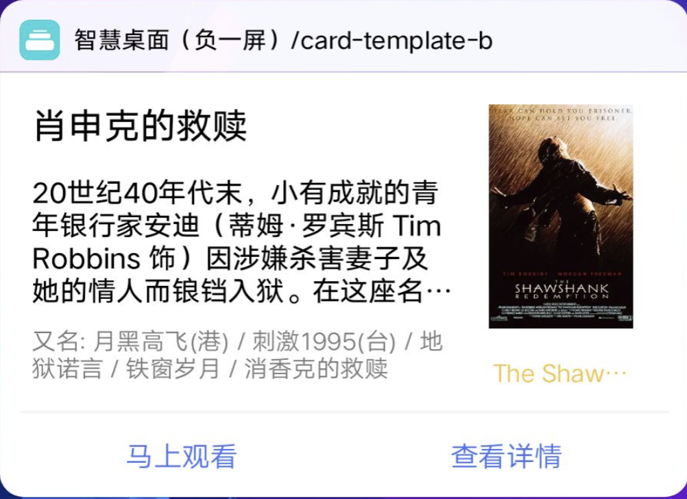

## 【模板】卡片模板 B

### 描述

图文复合类卡片模板，标题+正文+辅助说明+图片+按钮。

### 使用效果

<div style="text-align: center;margin: 40px;">

</div>

### 使用方法

在`.ux`文件中引入组件

```html
<import
  name="card-b"
  src="vivo-cards-suits/components/desktop/card-template-b/index"
></import>
```

### 示例

```html
<template>
  <card-b
    title="肖申克的救赎"
    content="20世纪40年代末，小有成就的青年银行家安迪（蒂姆·罗宾斯 Tim Robbins 饰）因涉嫌杀害妻子及她的情人而锒铛入狱。在这座名为肖申克的监狱内，希望似乎虚无缥缈，终身监禁的惩罚无疑注定了安迪接下来灰暗绝望的人生。未过多久，安迪尝试接近囚犯中颇有声望的瑞德（摩根·弗里曼 Morgan Freeman 饰），请求对方帮自己搞来小锤子。以此为契机，二人逐渐熟稔，安迪也仿佛在鱼龙混杂、罪恶横生、黑白混淆的牢狱中找到属于自己的求生之道。他利用自身的专业知识，帮助监狱管理层逃税、洗黑钱，同时凭借与瑞德的交往在犯人中间也渐渐受到礼遇。表面看来，他已如瑞德那样对那堵高墙从憎恨转变为处之泰然，但是对自由的渴望仍促使他朝着心中的希望和目标前进。而关于其罪行的真相，似乎更使这一切朝前推进了一步……"
    info="又名: 月黑高飞(港) / 刺激1995(台) / 地狱诺言 / 铁窗岁月 / 消香克的救赎"
    image-url="https://img3.doubanio.com/view/photo/s_ratio_poster/public/p480747492.webp"
    image-name="The Shawshank Redemption"
    buttons="{{buttons}}"
  ></card-b>
</template>
<script>
  export default {
    data() {
      return {
        buttons: [
          {
            text: "马上观看",
            url:
              "https://movie.douban.com/subject/27119724/?tag=%E7%83%AD%E9%97%A8&from=gaia"
          },
          {
            text: "查看详情",
            url:
              "https://movie.douban.com/subject/27119724/?tag=%E7%83%AD%E9%97%A8&from=gaia"
          }
        ]
      };
    }
  };
</script>
```

### API

#### 组件属性

| 属性        | 类型   | 默认值 | 说明                                   |
| ----------- | ------ | ------ | -------------------------------------- |
| title       | string | -      | 标题文本                               |
| content     | string | -      | 内容文本                               |
| info        | string | -      | 辅助说明文本                           |
| imageUrl    | string | -      | 图片地址，支持 base64                  |
| imageName   | string | -      | 图片名称                               |
| buttons     | array  | []     | 底部按钮组，最大支持三个按钮，最少一个 |
| button.text | string | '按钮' | 按钮组单个按钮文本                     |
| button.url  | string | -      | 按钮组单个按钮文本，点击后跳转地址     |
