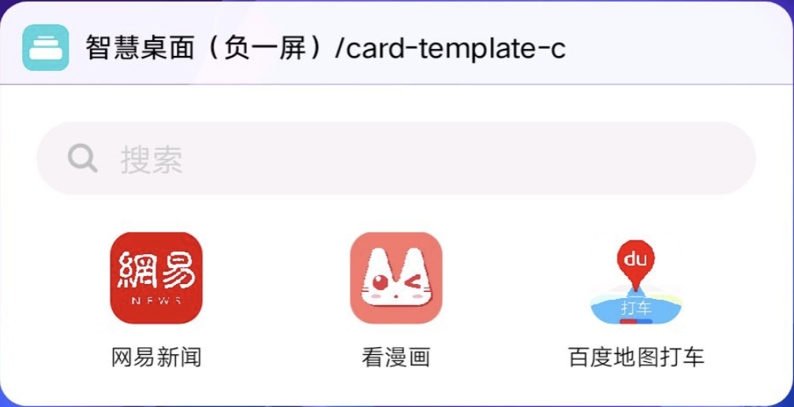

## 【模板】卡片模板 C

### 描述

搜索+图文按钮卡片模板。

### 使用效果

<div style="text-align: center;margin: 40px;">

</div>

### 使用方法

在`.ux`文件中引入组件

```html
<import
  name="card-c"
  src="vivo-cards-suits/components/desktop/card-template-c/index"
></import>
```

### 示例

```html
<template>
  <card-c icons="{{icons}}" url="hap://app/com.vivo.shop"></card-c>
</template>
<script>
  export default {
    data() {
      return {
        icons: [
          {
            imageUrl:
              "https://statres.quickapp.cn/quickapp/icon/201803/dd5f359e/f4e9449535a1e2141eda5a063c028bff.png",
            text: "网易新闻",
            url: "hap://app/com.vivo.shop"
          },
          {
            imageUrl:
              "https://statres.quickapp.cn/quickapp/icon/201909/72f02942/e3a0e7c80c26eff2765e74450585a0dc.png",
            text: "看漫画",
            url: "http://www.baidu.com"
          },
          {
            imageUrl:
              "https://statres.quickapp.cn/quickapp/icon/202001/a05bd0fb/d60d379bcba70a33119e9f74079f37c0.png",
            text: "百度地图打车",
            url: "http://www.baidu.com"
          }
        ]
      };
    }
  };
</script>
```

### API

| 属性          | 类型   | 默认值     | 说明                                    |
| ------------- | ------ | ---------- | --------------------------------------- |
| placeholder   | string | '搜索'     | 搜索栏提示文本                          |
| url           | string | -          | 搜索跳转地址，支持 base64               |
| iconType      | string | 'square'   | icon 的显示模式，可选值'square','round' |
| icons         | array  | []         | icon 组，最大支持 5 个 icon，最少一个   |
| icon.imageUrl | string | -          | icon 链接地址，支持 base64              |
| icon.text     | string | '文字模板' | 单个 icon 文本                          |
| icon.url      | string | -          | 单个 icon 点击后跳转的地址              |
