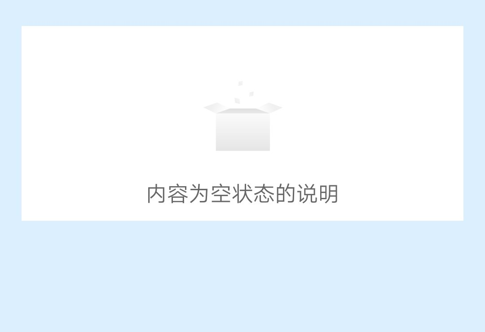
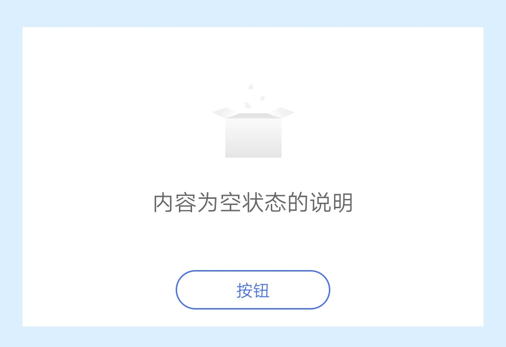

## 【组件】 空白组件 A

### 描述

jovi 主页 空白组件 A, 可展示网络错误状态和内容为空状态时的页面

### 使用效果

<div style="text-align: center;margin: 40px;">
  
  
</div>

### 使用方法

在`.ux`文件中引入组件

```html
<import
  name="component-blank-a"
  src="vivo-cards-suits/components/jovi/component-blank-a/index.ux"
></import>
```

### 示例

```html
<template>
  <div class="card">
    <component-blank-a
      status="{{status}}"
      content="{{content}}"
      button="{{button}}"
      onclickbtn="handleClickBtn"
    ></component-blank-a>
  </div>
</template>

<script>
  export default {
    data() {
      return {
        status: "blank", // blank network
        content: "内容为空状态的说明",
        button: "按钮"
      };
    },
    handleClickBtn() {
      console.log("点击按钮");
    }
  };
</script>

<style lang="less">
  .card {
    width: 100%;
    flex-direction: column;
  }
</style>
```

### API

#### 组件属性

| 属性    | 类型   | 默认值 | 说明                                                     |
| ------- | ------ | ------ | -------------------------------------------------------- |
| status  | String | blank  | 图片内容状态, blank: 内容为空图片, network: 网络错误图片 |
| content | String | -      | 说明内容                                                 |
| button  | String | -      | 按钮名称, 不传则不显示                                   |

#### 组件事件

| 事件名称 | 事件描述     | 返回值 |
| -------- | ------------ | ------ |
| clickbtn | 点击按钮触发 | -      |
