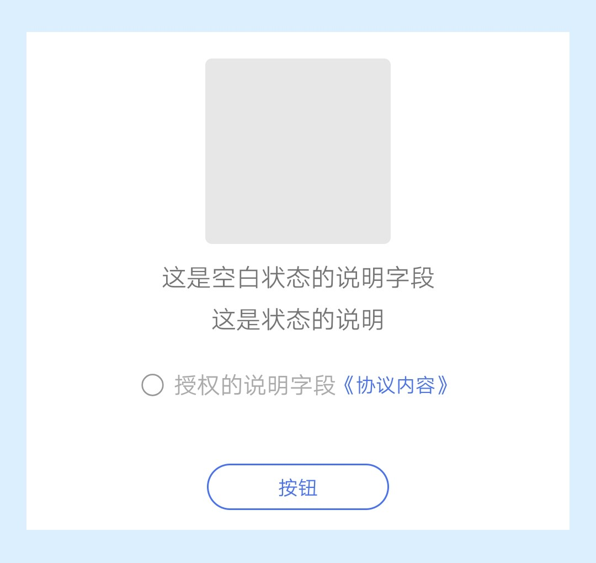
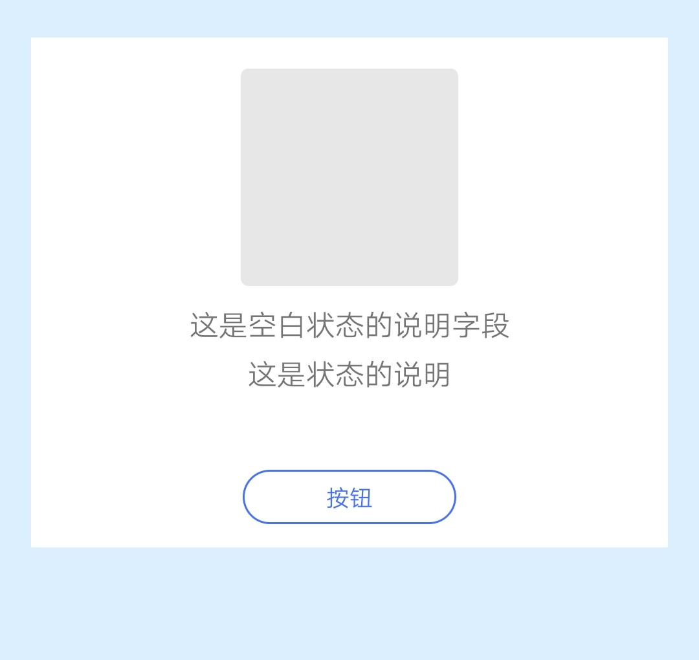
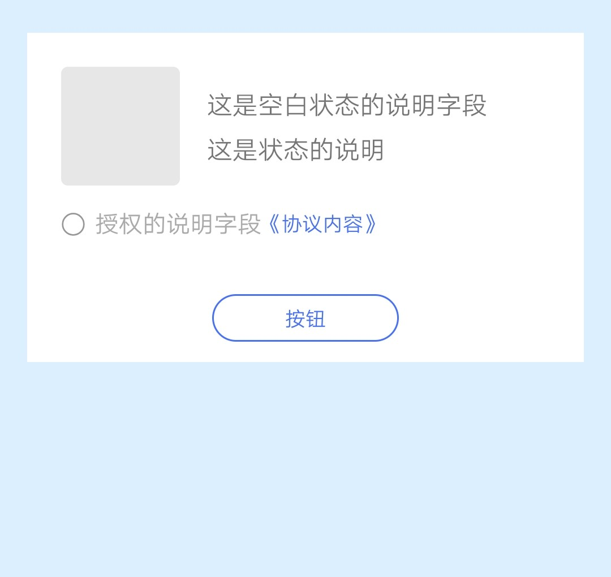
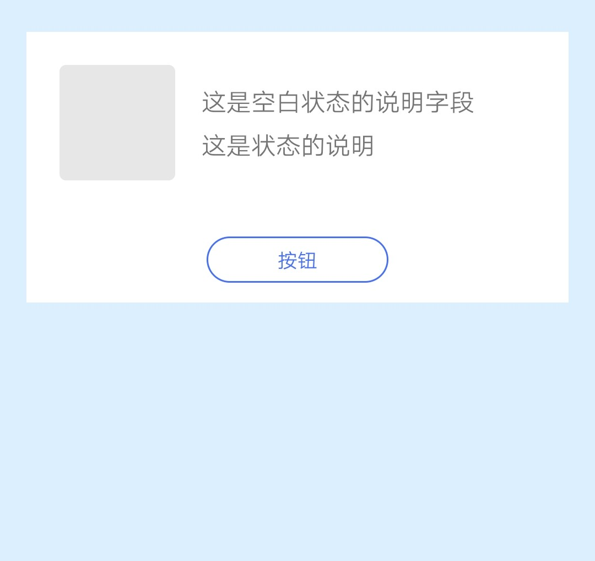

## 【组件】 空白组件 B

### 描述

jovi 主页 空白组件 B，可展示 jovi 主页和负一屏卡片的空白状态

### 使用效果

<div style="text-align: center;margin: 40px;">
  
  
  
  
</div>

### 使用方法

在`.ux`文件中引入组件

```html
<import
  name="component-blank-b"
  src="vivo-cards-suits/components/jovi/component-blank-b/index.ux"
></import>
```

### 示例

```html
<template>
  <div class="card">
    <component-blank-b
      status="{{status}}"
      img-url="{{imgUrl}}"
      info1="{{info1}}"
      info2="{{info2}}"
      auth="{{auth}}"
      agreement="{{agreement}}"
      button="{{button}}"
      onchangeauth="handleChangeAuth"
      onclickagreement="handleClickAgreement "
      onclickbtn="handleClickBtn"
    ></component-blank-b>
  </div>
</template>

<script>
  export default {
    data() {
      return {
        status: "jovi"，// jovi screen
        imgUrl: "imgUrl",
        info1: "这是空白状态的说明字段",
        info2: "这是状态的说明",
        auth: "授权的说明字段",
        agreement: "协议内容",
        button: "按钮"
      };
    },
    handleChangeAuth(e) {
      console.log(`当前选中状态: ${e.detail.checked}`);
    },
    handleClickAgreement() {
      console.log("点击协议内容");
    },
    handleClickBtn() {
      console.log("点击按钮");
    }
  };
</script>

<style lang="less">
  .card {
    width: 100%;
    flex-direction: column;
  }
</style>
```

### API

#### 组件属性

| 属性      | 类型   | 默认值 | 说明                                                                      |
| --------- | ------ | ------ | ------------------------------------------------------------------------- |
| status    | String | jovi   | 空白页面状态，可选值：jovi（jovi 主页空白状态），screen（负一屏空白状态） |
| imgUrl    | String | -      | 图片链接，支持 base64                                                     |
| info1     | String | -      | 空白状态的说明字段，不传则不显示                                          |
| info2     | String | -      | 状态说明，不传则不显示                                                    |
| auth      | String | -      | 授权的说明字段，不传则不显示                                              |
| agreement | String | -      | 协议内容，不传则不显示                                                    |
| button    | String | -      | 按钮名称，不传则不显示                                                    |

#### 组件事件

| 事件名称       | 事件描述               | 返回值                |
| -------------- | ---------------------- | --------------------- |
| changeauth     | 更换授权选中状态时触发 | {checked: '选中状态'} |
| clickagreement | 点击协议触发           | -                     |
| clickbtn       | 点击按钮触发           | -                     |
