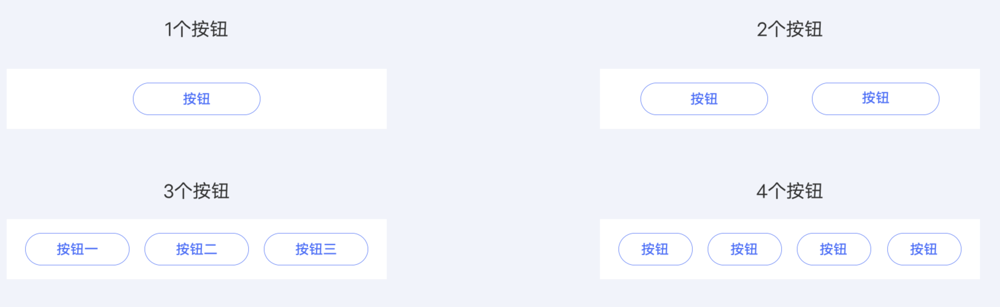

## 【组件】按钮组

### 描述

按钮组分为 1 ～ 4 个按钮样式，点击后可执行跳转或操作。需保持在卡片底部。

### 使用效果

<div style="text-align: center;margin: 40px;">

</div>

### 使用方法

在`.ux`文件中引入组件

```html
<import
  name="buttons"
  src="vivo-cards-suits/components/jovi/components/buttons"
></import>
```

### 示例

```html
<template>
  <div class="wrap">
    <buttons buttons="{{buttons}}" ontap="tapHandler"></buttons>
  </div>
</template>
<script>
  export default {
    data() {
      return {
        buttons: [
          {
            url: "",
            text: "功能按钮1"
          },
          {
            url: "",
            text: "功能按钮2"
          },
          {
            url: "",
            text: "功能按钮3"
          }
        ]
      };
    },
    tapHandler(e) {
      console.log(e.detail.index);
    }
  };
</script>
<style lang="less">
  .wrap {
    background-color: #ffffff;
    border-bottom-left-radius: ~"theme.borderBottomRadius";
    border-bottom-right-radius: ~"theme.borderBottomRadius";
    flex-direction: column;
  }
</style>
```

### API

| 属性        | 类型   | 默认值 | 说明                                            |
| ----------- | ------ | ------ | ----------------------------------------------- |
| tap         | event  | -      | 按钮点击触发事件，返回点击按钮序号{index:index} |
| buttons     | array  | []     | 按钮组                                          |
| button.text | string | '按钮' | 按钮文本                                        |
| button.url  | string | -      | 按钮跳转地址                                    |
