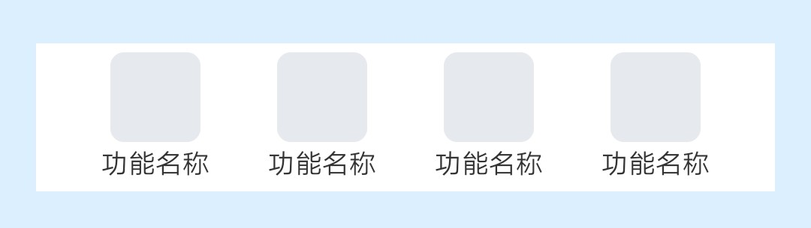

## 【组件】 图文入口组件

### 描述

jovi 主页 图文入口组件

### 使用效果

<div style="text-align: center;margin: 40px;">
  
</div>

### 使用方法

在`.ux`文件中引入组件

```html
<import
  name="component-entrance"
  src="vivo-cards-suits/components/jovi/component-entrance/index.ux"
></import>
```

### 示例

```html
<template>
  <div class="card">
    <component-entrance list-data="{{listData}}"></component-entrance>
  </div>
</template>

<script>
  export default {
    data() {
      return {
        listData: [
          {
            imgUrl: "imgUrl",
            name: "功能名称"
          },
          {
            imgUrl: "imgUrl",
            name: "功能名称"
          },
          {
            imgUrl: "imgUrl",
            name: "功能名称"
          },
          {
            imgUrl: "imgUrl",
            name: "功能名称"
          }
        ]
      };
    }
  };
</script>

<style lang="less">
  .card {
    width: 100%;
    flex-direction: column;
  }
</style>
```

### API

#### 组件属性

| 属性            | 类型   | 默认值 | 说明                                |
| --------------- | ------ | ------ | ----------------------------------- |
| listData        | Array  | -      | 列表数据，最大长度 4                |
| listData.imgUrl | String | -      | 图片地址，支持 base64，不传则不显示 |
| listData.name   | String | -      | 功能名称，小于 5 个字，不传则不显示 |
