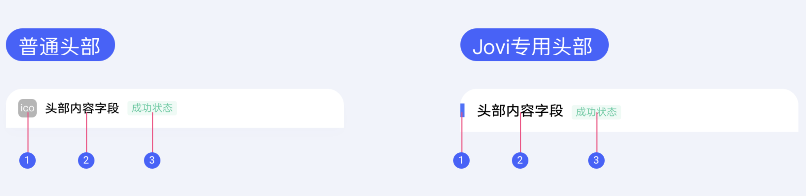

## 【组件】卡片头部组件

::: warning
如果要使用本组件，需要单独和 Jovi 客户端对接，让客户端不要为你的卡片加载默认 header。
:::

### 描述

普通头部使用卡片 icon，Jovi 卡片只能用 Jovi 专用头部。

### 使用效果

<div style="text-align: center;margin: 40px;">

</div>

### 使用方法

在`.ux`文件中引入组件

```html
<import
  name="header"
  src="vivo-cards-suits/components/jovi/components/header"
></import>
```

### 示例

```html
<template>
  <div class="wrap">
    <header
      icon="{{icon}}"
      title="电影榜单101"
      status="最近热门"
      status-type="error"
    ></header>
    <buttons buttons="{{buttons}}" ontap="tapHandler"></buttons>
  </div>
</template>
<script>
  export default {
    data() {
      return {
        icon:
          "https://statres.quickapp.cn/quickapp/icon/201911/fc3f343a/55892ef474922a4996bf2b7fe759e983.png",
        buttons: [
          {
            url: "",
            text: "切换头部样式"
          }
        ]
      };
    },
    tapHandler(e) {
      this.icon = "";
    }
  };
</script>
<style lang="less">
  .wrap {
    background-color: #ffffff;
    border-radius: ~"theme.borderBottomRadius";
    flex-direction: column;
  }
</style>
```

### API

| 属性       | 类型   | 默认值     | 说明                                                                    |
| ---------- | ------ | ---------- | ----------------------------------------------------------------------- |
| icon       | string | -          | icon 图片地址，支持 base64，不传显示 Jovi 专用头部样式                  |
| title      | string | '卡片标题' | 卡片标题                                                                |
| status     | string | '内容标题' | 卡片状态内容                                                            |
| statusType | string | -          | 状态类型，可选值有'success' 'error' 'warning' 'cancel' 以及 16 进制色彩 |
