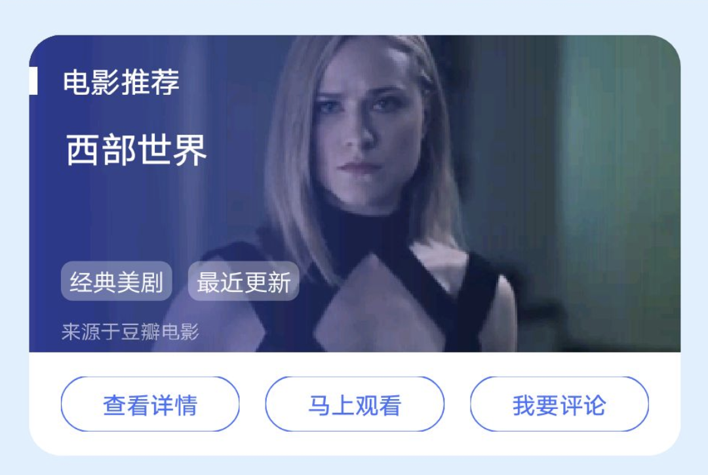

## 【组件】氛围头图组件

::: warning
如果要使用本组件，由于组件自带 header，所以需要单独和 Jovi 客户端对接，让客户端不要为你的卡片加载默认 header。
:::

### 描述

头图区只允许出现在卡片顶部，下方可搭配其他内容区模块或动作区模块。

### 使用效果

<div style="text-align: center;margin: 40px;">

</div>

### 使用方法

在`.ux`文件中引入组件

```html
<import
  name="image-header"
  src="vivo-cards-suits/components/jovi/components/image-header"
></import>
```

### 示例

```html
<template>
  <div class="wrap">
    <image-header
      image-url="https://img9.doubanio.com/view/movie_gallery_frame_hot_rec/normal/public/9e8bb8f6ebf4ed1.jpg"
      title="电影推荐"
      content="西部世界"
      tags="{{['经典美剧','最近更新']}}"
      info="来源于豆瓣电影"
    ></image-header>
    <buttons buttons="{{buttons}}"></buttons>
  </div>
</template>
<script>
  export default {
    data() {
      return {
        buttons: [
          {
            url: "",
            text: "查看详情"
          },
          {
            url: "",
            text: "马上观看"
          },
          {
            url: "",
            text: "我要评论"
          }
        ]
      };
    }
  };
</script>
<style lang="less">
  .wrap {
    background-color: #ffffff;
    border-radius: ~"theme.borderBottomRadius";
    flex-direction: column;
  }
</style>
```

### API

| 属性     | 类型   | 默认值     | 说明                      |
| -------- | ------ | ---------- | ------------------------- |
| imageUrl | string | -          | 氛围头图地址，支持 base64 |
| title    | string | '卡片标题' | 卡片标题                  |
| content  | string | '内容标题' | 内容标题                  |
| info     | string | -          | 辅助信息                  |
| tags     | array  | -          | 标签数组                  |
| tag      | string | -          | 单个标签文本              |
