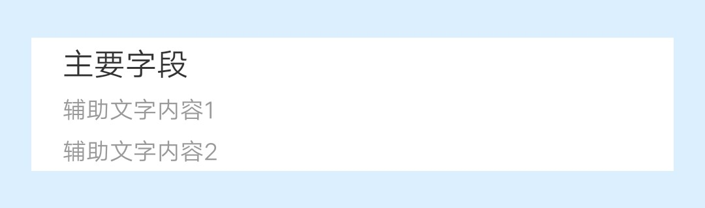
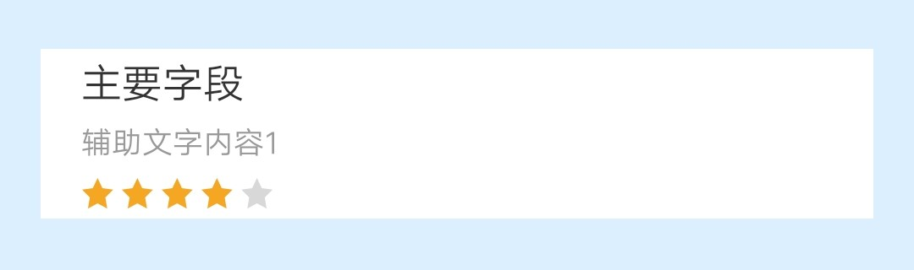
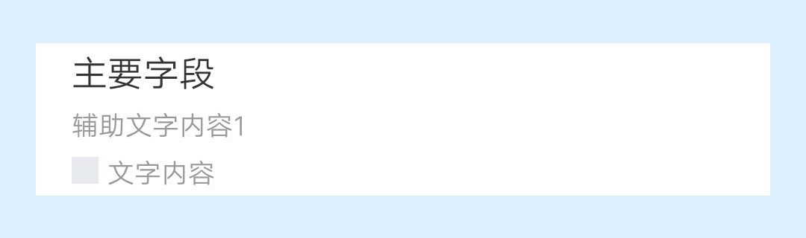
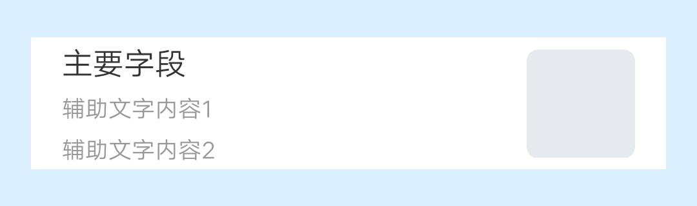
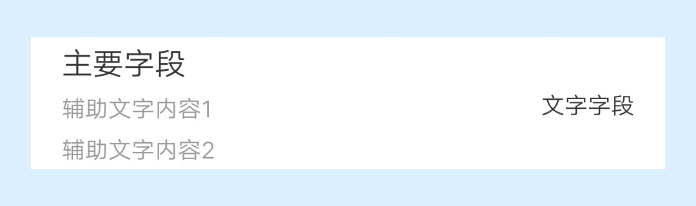
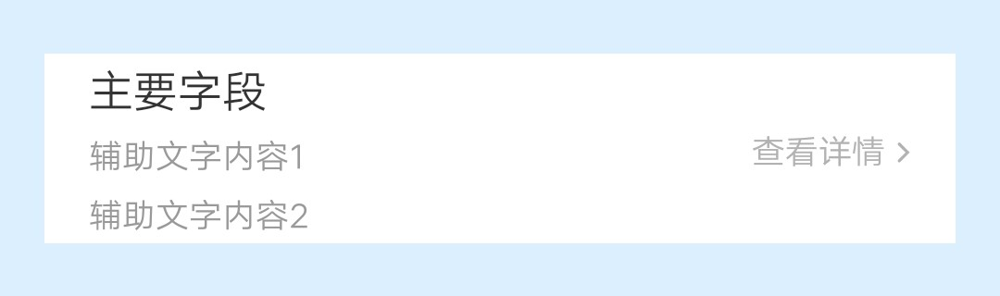
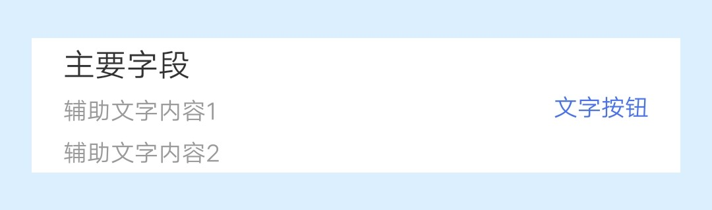
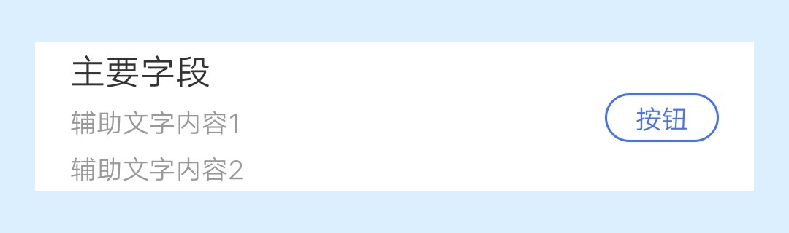
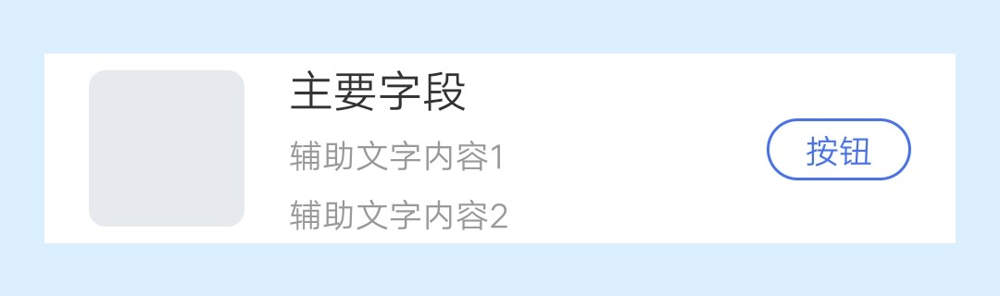

## 【组件】 列表组件 A

### 描述

jovi 主页 列表组件 A

### 使用效果

<div style="text-align: center;margin: 40px;">
  
  
  
</div>

<div style="text-align: center;margin: 40px;">
  
  
  
  
</div>

<div style="text-align: center;margin: 40px;">
  
  
</div>

### 使用方法

在`.ux`文件中引入组件

```html
<import
  name="component-list-item-a"
  src="vivo-cards-suits/components/jovi/component-list-item-a/index.ux"
></import>
```

### 示例

```html
<template>
  <div class="card">
    <component-list-item-a
      img-url="{{imgUrl}}"
      info1="{{info1}}"
      info2="{{info2}}"
      info-data="{{infoData}}"
      right-data="{{rightData}}"
      onclickbtn="handleClickBtn"
    ></component-list-item-a>
  </div>
</template>

<script>
  export default {
    data() {
      return {
        imgUrl: "imgUrl",
        info1: "主要字段",
        info2: "辅助文字内容1",
        infoData: {
          type: "A",
          text: "辅助文字内容2"
        },
        // infoData: {
        //   type: 'B',
        //   grade: 4
        // },
        // infoData: {
        //   type: 'C',
        //   icon: 'iconUrl',
        //   text: '文字内容',
        // },
        // rightData: {
        //   type: "A",
        //   imgUrl: "imgUrl"
        // }
        // rightData: {
        //   type: 'B',
        //   text: '文字字段'
        // },
        // rightData: {
        //   type: 'C',
        //   text: '查看详情'
        // },
        // rightData: {
        //   type: 'D',
        //   text: '文字按钮'
        // }
        rightData: {
          type: "E",
          text: "按钮"
        }
      };
    },
    handleClickBtn() {
      console.log("点击按钮");
    }
  };
</script>

<style lang="less">
  .card {
    width: 100%;
    flex-direction: column;
  }
</style>
```

### API

#### 组件属性

| 属性             | 类型   | 默认值 | 说明                                                                                     |
| ---------------- | ------ | ------ | ---------------------------------------------------------------------------------------- |
| imgUrl           | String | -      | 图标地址, 支持 base64, 不传则不显示                                                      |
| info1            | String | -      | 主要字段                                                                                 |
| info2            | String | -      | 辅助文字内容 1, 不传则不显示                                                             |
| infoData         | Object | -      | 辅助内容数据对象                                                                         |
| infoData.type    | String | -      | 辅助内容类型, 可选值: A, B, C; A: 文字 B: 评分星级 C: icon+文字                          |
| infoData.text    | String | -      | 文字                                                                                     |
| infoData.icon    | String | -      | 图标地址, 支持 base64                                                                    |
| rightData        | Object | -      | 右侧内容数据对象, 不传则不显示                                                           |
| rightData.type   | String | -      | 右侧内容类型, 可选值: A, B, C, D, E; A: 图片 B: 文字字段 C: 查看详情 D: 文字按钮 E: 按钮 |
| rightData.imgUrl | String | -      | 图标地址, 支持 base64                                                                    |
| rightData.text   | String | -      | 文字                                                                                     |

#### 组件事件

| 事件名称 | 事件描述     | 返回值 |
| -------- | ------------ | ------ |
| clickbtn | 点击按钮触发 | -      |
