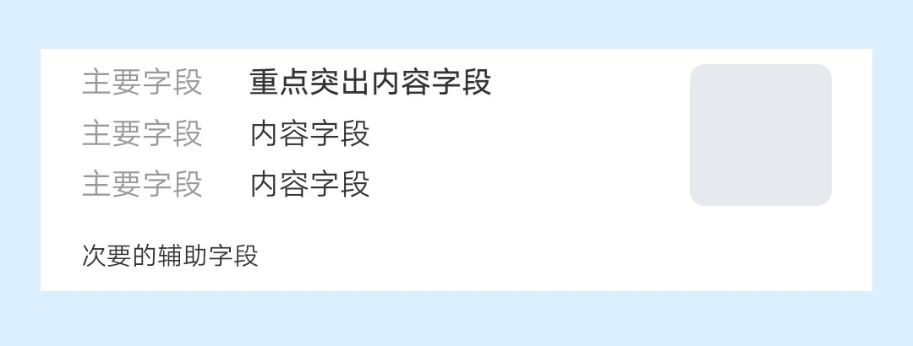

## 【组件】 列表组件 B

### 描述

jovi 主页 列表组件 B

### 使用效果

<div style="text-align: center;margin: 40px;">
  
</div>

### 使用方法

在`.ux`文件中引入组件

```html
<import
  name="component-list-item-b"
  src="vivo-cards-suits/components/jovi/component-list-item-b/index.ux"
></import>
```

### 示例

```html
<template>
  <div class="card">
    <component-list-item-b
      info-list="{{infoList}}"
      info="{{info}}"
      img-url="{{imgUrl}}"
    ></component-list-item-b>
  </div>
</template>

<script>
  export default {
    data() {
      return {
        infoList: [
          {
            key: "主要字段",
            value: "重点突出内容字段",
            strong: true
          },
          {
            key: "主要字段",
            value: "内容字段"
          },
          {
            key: "主要字段",
            value: "内容字段"
          }
        ],
        info: "次要的辅助字段",
        imgUrl: "imgUrl"
      };
    }
  };
</script>

<style lang="less">
  .card {
    width: 100%;
    flex-direction: column;
  }
</style>
```

### API

#### 组件属性

| 属性              | 类型   | 默认值 | 说明                                |
| ----------------- | ------ | ------ | ----------------------------------- |
| infoList          | Array  | -      | 信息列表数组                        |
| infoList[].key    | String | -      | 主要字段                            |
| infoList[].value  | String | -      | 辅助的说明字段                      |
| infoList[].strong | String | -      | 是否加粗显示                        |
| rightData.imgUrl  | String | -      | 图标地址, 支持 base64, 不填则不显示 |
