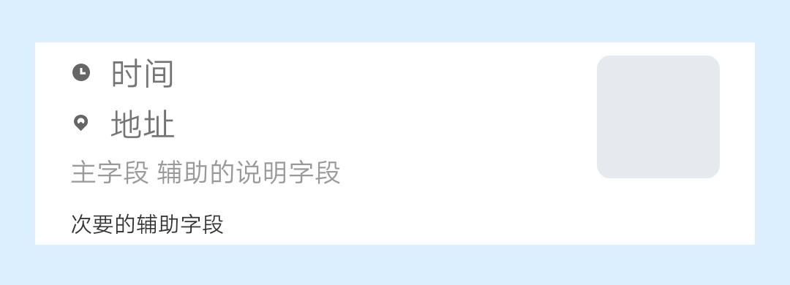

## 【组件】 列表组件 C

### 描述

jovi 主页 列表组件 C

### 使用效果

<div style="text-align: center;margin: 40px;">
  
</div>

### 使用方法

在`.ux`文件中引入组件

```html
<import
  name="component-list-item-c"
  src="vivo-cards-suits/components/jovi/component-list-item-c/index.ux"
></import>
```

### 示例

```html
<template>
  <div class="card">
    <component-list-item-c
      time="{{time}}"
      address="{{address}}"
      info1="{{info1}}"
      info2="{{info2}}"
      img-url="{{imgUrl}}"
    ></component-list-item-c>
  </div>
</template>

<script>
  export default {
    data() {
      return {
        time: "时间",
        address: "地址",
        info1: "主字段 辅助的说明字段",
        info2: "次要的辅助字段",
        imgUrl: "imgUrl"
      };
    }
  };
</script>

<style lang="less">
  .card {
    width: 100%;
    flex-direction: column;
  }
</style>
```

### API

#### 组件属性

| 属性             | 类型   | 默认值 | 说明                                |
| ---------------- | ------ | ------ | ----------------------------------- |
| time             | String | -      | 时间                                |
| address          | String | -      | 地址                                |
| info1            | String | -      | 主字段, 辅助的说明字段              |
| info2            | String | -      | 次要的辅助字段                      |
| rightData.imgUrl | String | -      | 图标地址, 支持 base64, 不填则不显示 |
