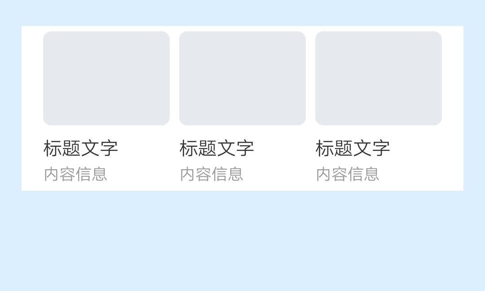
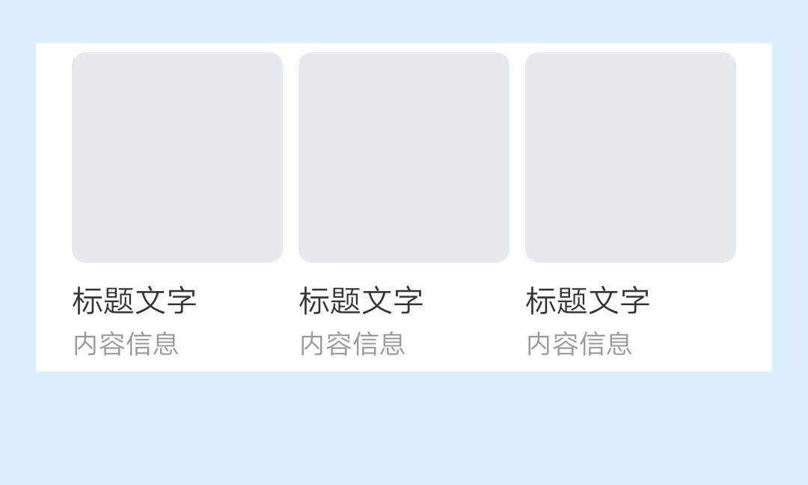
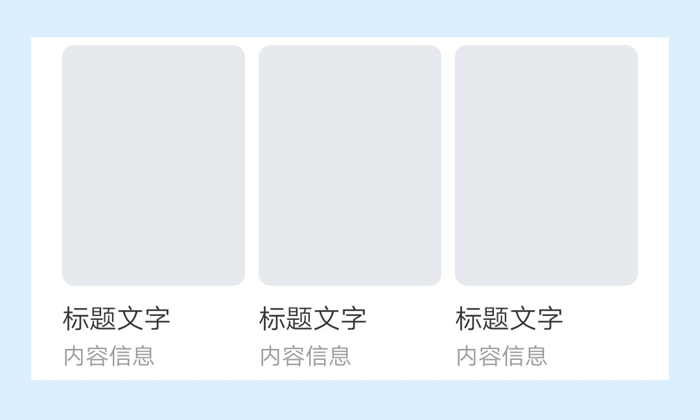
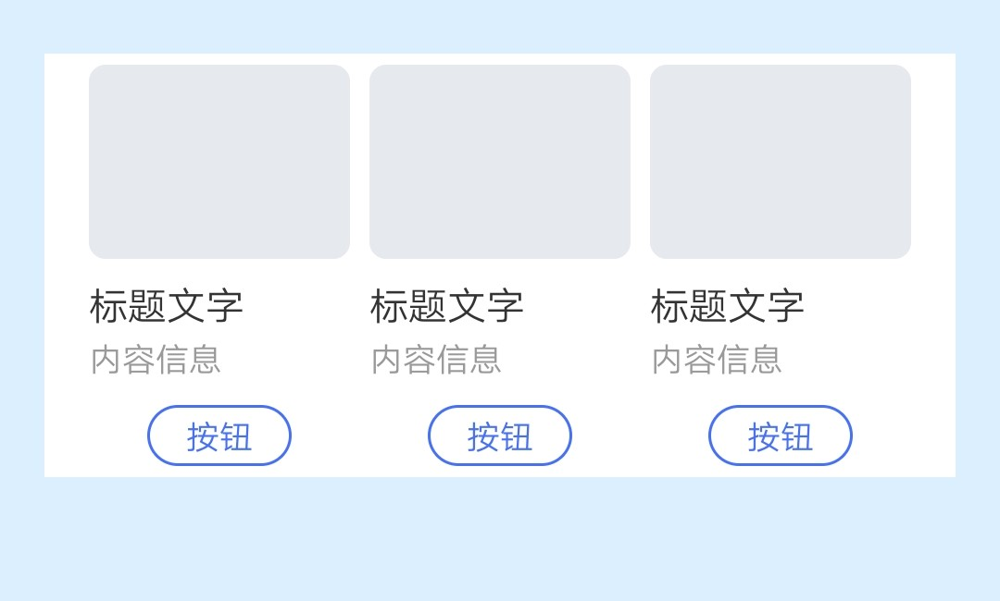

## 【组件】 图文组件

### 描述

jovi 主页 图文组件

### 使用效果

<div style="text-align: center;margin: 40px;">
  
  
  
  
</div>

### 使用方法

在`.ux`文件中引入组件

```html
<import
  name="component-picture-a"
  src="vivo-cards-suits/components/jovi/component-picture-a/index.ux"
></import>
```

### 示例

```html
<template>
  <div class="card">
    <component-picture-a
      img-type="{{imgType}}"
      list-data="{{listData}}"
      button="{{button}}"
      onclick="handleClickBtn"
    ></component-picture-a>
  </div>
</template>

<script>
  export default {
    data() {
      return {
        imgType: "A",
        listData: [
          {
            imgUrl: "imgUrl",
            title: "标题文字",
            content: "内容信息"
          },
          {
            imgUrl: "imgUrl",
            title: "标题文字",
            content: "内容信息"
          },
          {
            imgUrl: "imgUrl",
            title: "标题文字",
            content: "内容信息"
          }
        ],
        button: "按钮"
      };
    },
    handleClickBtn(e) {
      console.log(`点击按钮 index: ${e.detail.index}`);
    }
  };
</script>

<style lang="less">
  .card {
    width: 100%;
    flex-direction: column;
  }
</style>
```

### API

#### 组件属性

| 属性             | 类型   | 默认值 | 说明                                |
| ---------------- | ------ | ------ | ----------------------------------- |
| imgType          | String | A      | 图片类型, 可选值: A, B, C           |
| listData         | Array  | -      | 列表数据，最大长度 3                |
| listData.imgUrl  | String | -      | 图片地址，支持 base64，不传则不显示 |
| listData.title   | String | -      | 标题文字，小于 6 个字，不传则不显示 |
| listData.content | String | -      | 内容文字，小于 7 个字，不传则不显示 |
| button           | String | -      | 按钮名称，不传则不显示              |

#### 组件事件

| 事件名称 | 事件描述     | 返回值              |
| -------- | ------------ | ------------------- |
| clickbtn | 点击按钮触发 | {index: '按钮下标'} |
