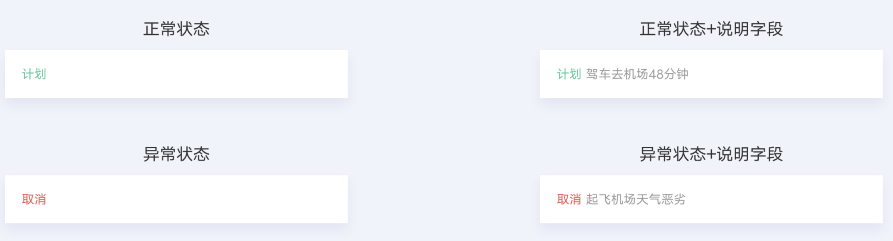

## 【组件】服务状态组件

### 描述

用于显示服务状态

### 使用效果

<div style="text-align: center;margin: 40px;">

</div>

### 使用方法

在`.ux`文件中引入组件

```html
<import
  name="status"
  src="vivo-cards-suits/components/jovi/components/status"
></import>
```

### 示例

```html
<import name="status" src="../../../components/jovi/components/status"></import>
<template>
  <div class="wrap">
    <status type="success" title="计划" info="驾车去机场"></status>
  </div>
</template>
<script>
  export default {};
</script>
<style lang="less">
  .wrap {
    background-color: #ffffff;
    border-bottom-left-radius: ~"theme.borderBottomRadius";
    border-bottom-right-radius: ~"theme.borderBottomRadius";
    flex-direction: column;
  }
</style>
```

### API

| 属性  | 类型   | 默认值    | 说明                                                                        |
| ----- | ------ | --------- | --------------------------------------------------------------------------- |
| type  | string | 'success' | 状态类型，支持传入 16 进制色彩，可选值有'succes','error','warning','cancel' |
| title | string | -         | 状态标题                                                                    |
| info  | string | -         | 状态解释信息                                                                |
