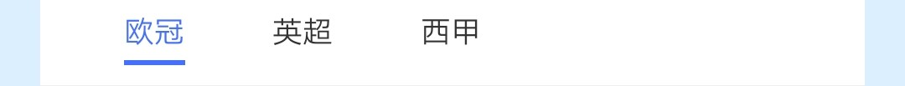
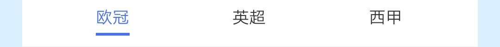
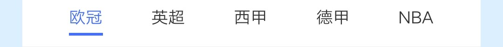
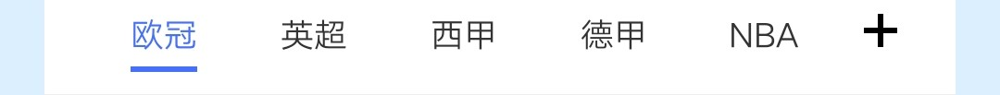

## 【组件】 tabs 组件

### 描述

jovi 主页 tabs 组件

### 使用效果

<div style="text-align: center;margin: 40px;">
  
  
  
  
</div>

### 使用方法

在`.ux`文件中引入组件

```html
<import
  name="component-tabs"
  src="vivo-cards-suits/components/jovi/component-tabs/index.ux"
></import>
```

### 示例

```html
<template>
  <div class="card">
    <component-tabs
      id="tabs"
      tabs="{{tabs}}"
      current="{{current}}"
      tab-align="{{tabAlign}}"
      add="{{add}}"
      onclicktab="handleClickTab"
      onclickadd="handleClickAdd"
    ></component-tabs>
    <swiper
      id="swiper"
      class="tab-content-swiper"
      indicator="{{false}}"
      loop="{{false}}"
      onchange="handleChangeSwiper"
    >
      <div class="tab-content" for="{{tabs}}">
        <text>{{ $item }}</text>
      </div>
    </swiper>
  </div>
</template>

<script>
  export default {
    data() {
      return {
        tabs: ["欧冠", "英超", "西甲", "德甲", "NBA"],
        // tabs: ['欧冠','英超','西甲','德甲','NBA','欧冠','英超','西甲','德甲','NBA'],
        current: 0,
        tabAlign: "center", // left center
        add: false
      };
    },
    handleClickTab(e) {
      this.current = e.detail.index;
      this.$element("swiper").swipeTo({ index: e.detail.index }); // 点击tab时，内容页跟随切换
    },
    handleClickAdd() {
      console.log("点击添加按钮");
    },
    handleChangeSwiper(e) {
      this.current = e.index;
      this.$child("tabs").scrollTo(e.index); // 滑动内容页时，tab跟随切换
    }
  };
</script>

<style lang="less">
  .card {
    width: 100%;
    flex-direction: column;
    .tab-content-swiper {
      width: 100%;
      height: 500px;
      background-color: #eee;
      .tab-content {
        flex: 1;
        text {
          flex: 1;
          text-align: center;
        }
      }
    }
  }
</style>
```

### API

#### 组件属性

| 属性     | 类型    | 默认值 | 说明                                                                                |
| -------- | ------- | ------ | ----------------------------------------------------------------------------------- |
| tabs     | Array   | -      | 标签栏数据，标签数量超过 5 个可横向滚动                                             |
| current  | Number  | -      | 选中的标签下标                                                                      |
| tabAlign | String  | left   | 标签对齐方式，可选值: left, center; 当设置 center 时, tab 数量小于 5 时会自适应居中 |
| add      | Boolean | false  | 是否显示添加按钮                                                                    |

#### 组件事件

| 事件名称 | 事件描述         | 返回值              |
| -------- | ---------------- | ------------------- |
| clicktab | 点击标签触发     | {index: '标签下标'} |
| clickadd | 点击添加按钮触发 | -                   |
