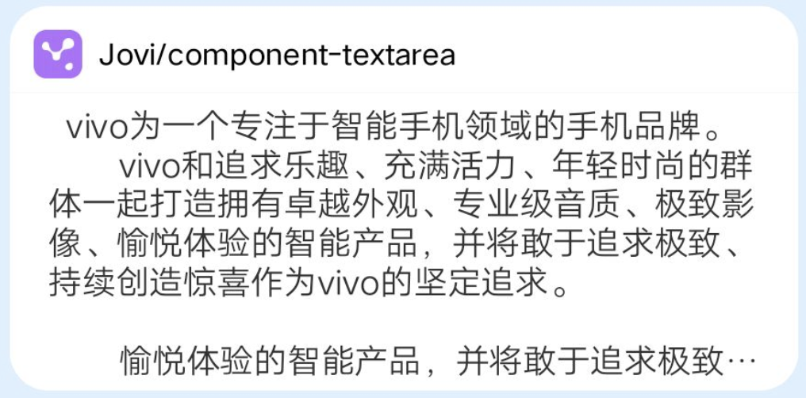

## 【组件】textarea 组件

### 描述

textarea 独占一块区域，此区域内的文本可以换行显示，超过显示区域后省略多余内容。

### 使用效果

<div style="text-align: center;margin: 40px;">

</div>

### 使用方法

在`.ux`文件中引入组件

```html
<import
  name="v-textarea"
  src="vivo-cards-suits/components/jovi/components/textarea"
></import>
```

### 示例

```html
<template>
  <div class="card">
    <v-textarea lines="7" text="{{text}}"></v-textarea>
  </div>
</template>

<script>
  export default {
    data() {
      return {
        text: `  vivo为一个专注于智能手机领域的手机品牌。
        vivo和追求乐趣、充满活力、年轻时尚的群体一起打造拥有卓越外观、专业级音质、极致影像、愉悦体验的智能产品，并将敢于追求极致、持续创造惊喜作为vivo的坚定追求。

        愉悦体验的智能产品，并将敢于追求极致、持续创造惊喜作为vivo的坚定追求`
      };
    }
  };
</script>

<style lang="less">
  .card {
    background-color: #ffffff;
    border-bottom-left-radius: ~"theme.borderBottomRadius";
    border-bottom-right-radius: ~"theme.borderBottomRadius";
    flex-direction: column;
  }
</style>
```

### API

| 属性  | 类型   | 默认值 | 说明             |
| ----- | ------ | ------ | ---------------- |
| lines | number | 5      | 文本显示最大行数 |
| text  | string | -      | 要显示的文本内容 |
