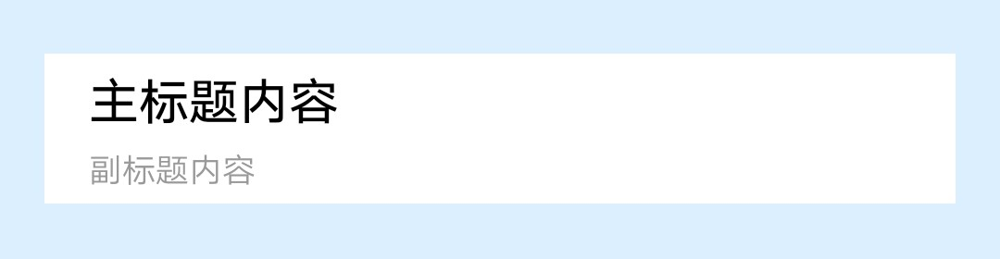

## 【组件】 标题组件

### 描述

jovi 主页 标题组件

### 使用效果

<div style="text-align: center;margin: 40px;">
  
</div>

### 使用方法

在`.ux`文件中引入组件

```html
<import
  name="component-title"
  src="vivo-cards-suits/components/jovi/component-title/index.ux"
></import>
```

### 示例

```html
<template>
  <div class="card">
    <component-title
      title="{{title}}"
      subtitle="{{subtitle}}"
    ></component-title>
  </div>
</template>

<script>
  import router from "@system.router";

  export default {
    data() {
      return {
        title: "主标题内容",
        subtitle: "副标题内容"
      };
    }
  };
</script>

<style lang="less">
  .card {
    width: 100%;
    flex-direction: column;
  }
</style>
```

### API

#### 组件属性

| 属性     | 类型   | 默认值 | 说明       |
| -------- | ------ | ------ | ---------- |
| title    | String | -      | 主标题内容 |
| subtitle | String | -      | 副标题内容 |
