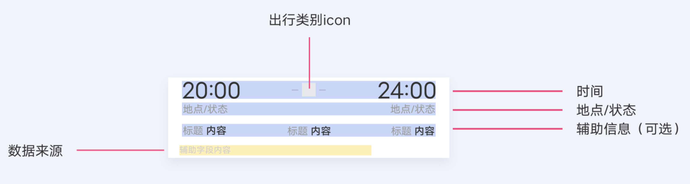

## 【组件】旅行信息类组件

### 描述

出行模块为特定样式模块，当前仅使用于机票、火车票、酒店行程卡片。与服务状态、按钮的组合取决于各卡片自身的需求

### 使用效果

<div style="text-align: center;margin: 40px;">

</div>

### 使用方法

在`.ux`文件中引入组件

```html
<import
  name="travel"
  src="vivo-cards-suits/components/jovi/components/travel"
></import>
```

### 示例

```html
<template>
  <div class="wrap">
    <travel
      start-time="12:30"
      end-time="13:48"
      icon="https://www.google.com/images/branding/googlelogo/2x/googlelogo_color_92x30dp.png"
      status-l="深圳北"
      status-r="广州南"
      content-data="{{contentData}}"
      info="数据由高铁管家提供"
    ></travel>
  </div>
</template>
<script>
  export default {
    data() {
      return {
        contentData: [
          {
            title: "乘客",
            content: "罗丹"
          },
          {
            title: "座位",
            content: "7车8B"
          }
        ]
      };
    }
  };
</script>
<style lang="less">
  .wrap {
    background-color: #ffffff;
    border-bottom-left-radius: ~"theme.borderBottomRadius";
    border-bottom-right-radius: ~"theme.borderBottomRadius";
    flex-direction: column;
  }
</style>
```

### API

| 属性         | 类型   | 默认值 | 说明                                |
| ------------ | ------ | ------ | ----------------------------------- |
| plus         | string | -      | 时间跨天时传入，举例+1，+2          |
| startTime    | string | -      | 开始时间                            |
| endTime      | string | -      | 到达时间                            |
| icon         | string | -      | 图片地址，支持 base64，不传则不显示 |
| status-l     | object | -      | 左边地点/状态文本                   |
| status-r     | string | '按钮' | 右边地点/状态文本                   |
| info         | string | '按钮' | 底部数据来源文本                    |
| contentData  | array  | -      | 辅助信息文本数组                    |
| item.title   | string | -      | 单个辅助信息文本标题                |
| item.content | string | -      | 单个辅助信息文本内容                |
