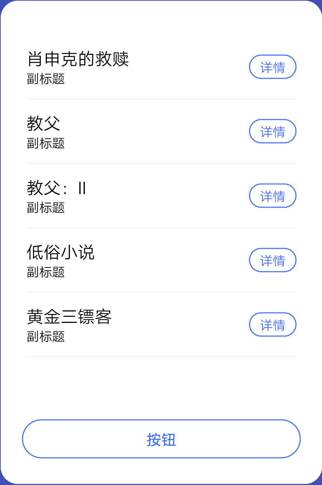

## 【组件】列表组件 B

### 描述

列表样式，用于图文列表

### 使用效果

<div style="text-align: center;margin: 40px;">

</div>

### 使用方法

在`.ux`文件中引入组件

```html
<import
  name="list-item-b"
  src="vivo-cards-suits/components/screen/components/list-item-b"
></import>
```

### 示例

```html
<template>
  <list class="content">
    <list-item class="list-item" type="list" for="{{item in listData}}">
      <list-item-b
        title="{{item.title}}"
        sub-title="{{item.subTitle}}"
        button="{{item.button}}"
      ></list-item-b>
    </list-item>
  </list>
</template>
<script>
  export default {
    data() {
      return {
        listData: [
          {
            image:
              "http://posters.imdb.cn/upload/2016/08/22/vNgaX4hhj_1471854359.jpg",
            title: "肖申克的救赎",
            info1: "片名：The Shawshank Redemption",
            info2: "导演： 弗兰克·达拉邦特 Frank Darabont） ",
            button: {
              text: "详情",
              url: "http://www.imdb.cn/title/tt0111161"
            }
          },
          {
            image:
              "http://posters.imdb.cn/upload/2016/08/26/NGiDp8KS3_1472192982.jpg",
            title: "教父",
            info1: "片名：The Godfather",
            info2: "导演： 弗朗西斯·福特·科波拉 Francis Ford Coppola）",
            button: {
              text: "详情",
              url: "http://www.imdb.cn/title/tt0068646"
            }
          },
          {
            image:
              "http://posters.imdb.cn/upload/1980/07/07/RgYKt147N_1180702311.jpg",
            title: "教父：II",
            info1: "片名：The Godfather: Part II",
            info2: "导演： 弗朗西斯·福特·科波拉 Francis Ford Coppola）",
            button: {
              text: "详情",
              url: "http://www.imdb.cn/title/tt0071562"
            }
          },
          {
            image:
              "http://posters.imdb.cn/upload/2003/03/08/1Bhi80Jxx_1177989811.jpg",
            title: "低俗小说",
            info1: "片名：The Shawshank Redemption",
            info2: "导演： 弗兰克·达拉邦特 Frank Darabont） ",
            button: {
              text: "详情",
              url: "http://www.imdb.cn/title/tt0111161"
            }
          },
          {
            image:
              "http://posters.imdb.cn/upload/1999/03/29/62RLIR9saC_1148432357.jpg",
            title: "黄金三镖客",
            info1: "片名：The Shawshank Redemption",
            info2: "导演： 弗兰克·达拉邦特 Frank Darabont） ",
            button: {
              text: "详情",
              url: "http://www.imdb.cn/title/tt0111161"
            }
          }
        ]
      };
    }
  };
</script>
```

### API

#### 组件属性

| 属性        | 类型   | 默认值 | 说明         |
| ----------- | ------ | ------ | ------------ |
| title       | string | -      | 标题         |
| subTitle    | string | -      | 副标题       |
| button      | object | -      | 按钮对象     |
| button.text | string | '按钮' | 按钮文本     |
| button.url  | string | -      | 按钮跳转地址 |
