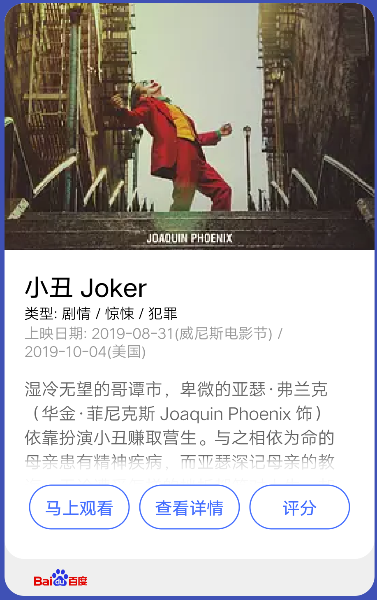
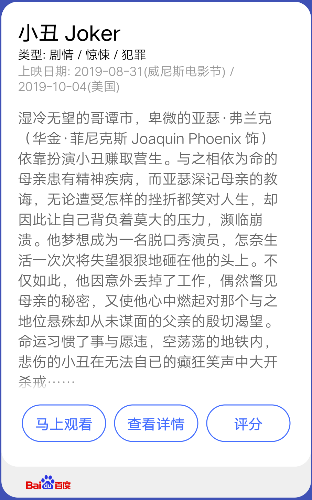

## 【模板】卡片模板 A

### 描述

图文类卡片模板，可用于展示图片文本内容。

### 使用效果

<div style="text-align: center;margin: 40px;">


</div>

### 使用方法

在`.ux`文件中引入组件

```html
<import
  name="card-a"
  src="vivo-cards-suits/components/screen/card-template-a/index"
></import>
```

### 示例

```html
<template>
  <card-a
    cover-url="https://img9.doubanio.com/view/photo/s_ratio_poster/public/p2567198874.webp"
    title="小丑 Joker"
    sub-title="类型: 剧情 / 惊悚 / 犯罪"
    info="上映日期: 2019-08-31(威尼斯电影节) / 2019-10-04(美国)"
    description="湿冷无望的哥谭市，卑微的亚瑟·弗兰克（华金·菲尼克斯 Joaquin Phoenix 饰）依靠扮演小丑赚取营生。与之相依为命的母亲患有精神疾病，而亚瑟深记母亲的教诲，无论遭受怎样的挫折都笑对人生，却因此让自己背负着莫大的压力，濒临崩溃。他梦想成为一名脱口秀演员，怎奈生活一次次将失望狠狠地砸在他的头上。不仅如此，他因意外丢掉了工作，偶然瞥见母亲的秘密，又使他心中燃起对那个与之地位悬殊却从未谋面的父亲的殷切渴望。命运习惯了事与愿违，空荡荡的地铁内，悲伤的小丑在无法自已的癫狂笑声中大开杀戒……"
    logo-url="https://www.baidu.com/img/baidu_resultlogo@2.png"
    buttons="{{buttons}}"
  ></card-a>
</template>
<script>
  export default {
    data() {
      return {
        buttons: [
          {
            text: "马上观看",
            url:
              "https://movie.douban.com/subject/27119724/?tag=%E7%83%AD%E9%97%A8&from=gaia"
          },
          {
            text: "查看详情",
            url:
              "https://movie.douban.com/subject/27119724/?tag=%E7%83%AD%E9%97%A8&from=gaia"
          },
          {
            text: "评分",
            url:
              "https://movie.douban.com/subject/27119724/?tag=%E7%83%AD%E9%97%A8&from=gaia"
          },
          {
            text: "马上观看4",
            url:
              "https://movie.douban.com/subject/27119724/?tag=%E7%83%AD%E9%97%A8&from=gaia"
          }
        ]
      };
    }
  };
</script>
```

### API

#### 组件属性

| 属性        | 类型   | 默认值 | 说明                                          |
| ----------- | ------ | ------ | --------------------------------------------- |
| coverUrl    | string | -      | 封面图地址，支持 base64，不传则不显示         |
| title       | string | -      | 标题                                          |
| subTitle    | string | -      | 副标题                                        |
| info        | string | -      | 辅助信息                                      |
| description | string | -      | 详情文本                                      |
| logoUrl     | string | -      | 底部 logo 地址，支持 base64，不传则不显示底部 |
| buttons     | array  | []     | 底部按钮组，最大支持三个按钮，最少一个        |
| button.text | string | '按钮' | 按钮组单个按钮文本                            |
| button.url  | string | -      | 按钮组单个按钮文本，点击后跳转地址            |
