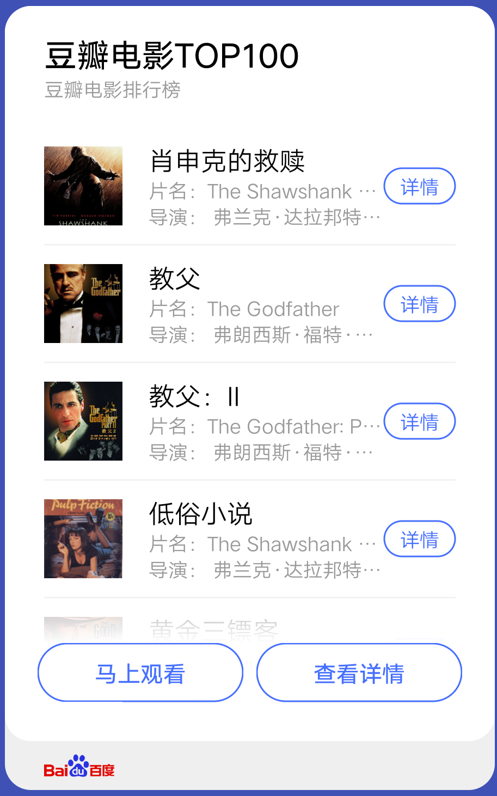
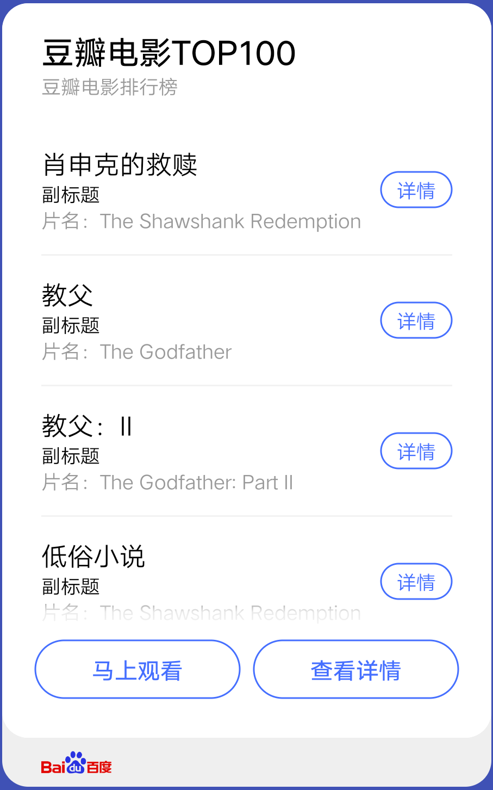
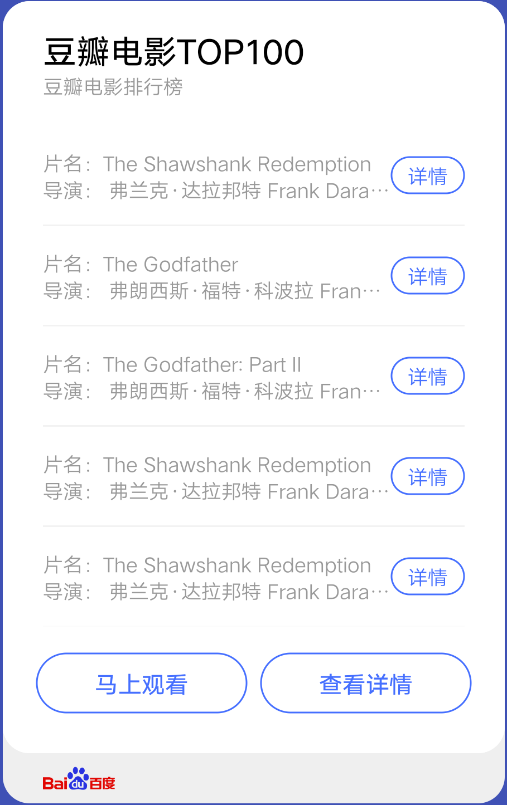
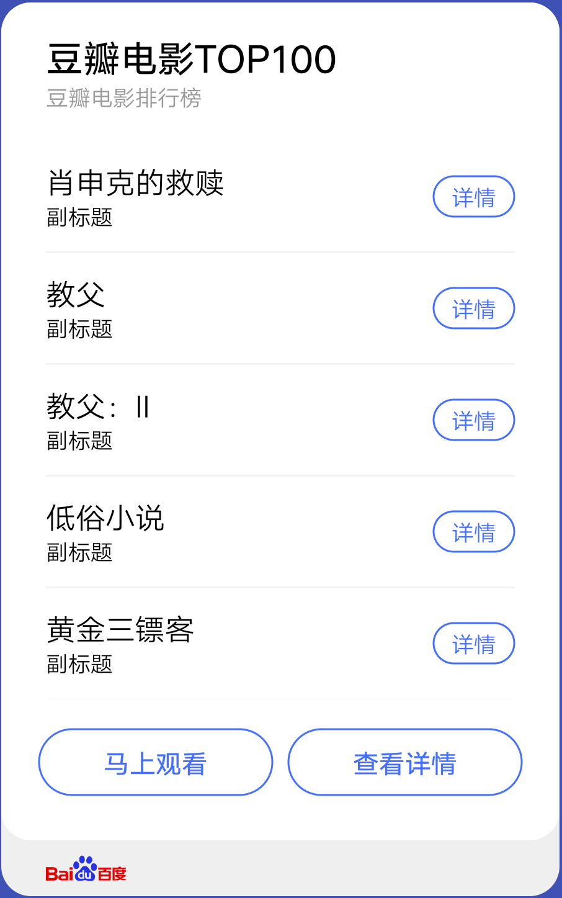

## 【模板】卡片模板 B

### 描述

列表类卡片模板，可用于展示图文列表内容。

### 使用效果

<div style="text-align: center;margin: 40px;">




</div>

### 使用方法

在`.ux`文件中引入组件

```html
<import
  name="card-b"
  src="vivo-cards-suits/components/screen/card-template-b/index"
></import>
```

### 示例

```html
<template>
  <card-b
    title="豆瓣电影TOP100"
    info="豆瓣电影排行榜"
    list-type="{{listType}}"
    list-data="{{listData}}"
    logo-url="https://www.baidu.com/img/baidu_resultlogo@2.png"
    buttons="{{buttons}}"
  ></card-b>
</template>
<script>
  export default {
    data() {
      return {
        buttons: [
          {
            text: "马上观看",
            url:
              "https://movie.douban.com/subject/27119724/?tag=%E7%83%AD%E9%97%A8&from=gaia"
          },
          {
            text: "查看详情",
            url:
              "https://movie.douban.com/subject/27119724/?tag=%E7%83%AD%E9%97%A8&from=gaia"
          }
        ],
        listType: "A",
        listData: [
          {
            image:
              "http://posters.imdb.cn/upload/2016/08/22/vNgaX4hhj_1471854359.jpg",
            title: "肖申克的救赎",
            info1: "片名：The Shawshank Redemption",
            info2: "导演： 弗兰克·达拉邦特 Frank Darabont） ",
            button: {
              text: "详情",
              url: "http://www.imdb.cn/title/tt0111161"
            }
          },
          {
            image:
              "http://posters.imdb.cn/upload/2016/08/26/NGiDp8KS3_1472192982.jpg",
            title: "教父",
            info1: "片名：The Godfather",
            info2: "导演： 弗朗西斯·福特·科波拉 Francis Ford Coppola）",
            button: {
              text: "详情",
              url: "http://www.imdb.cn/title/tt0068646"
            }
          },
          {
            image:
              "http://posters.imdb.cn/upload/1980/07/07/RgYKt147N_1180702311.jpg",
            title: "教父：II",
            info1: "片名：The Godfather: Part II",
            info2: "导演： 弗朗西斯·福特·科波拉 Francis Ford Coppola）",
            button: {
              text: "详情",
              url: "http://www.imdb.cn/title/tt0071562"
            }
          },
          {
            image:
              "http://posters.imdb.cn/upload/2003/03/08/1Bhi80Jxx_1177989811.jpg",
            title: "低俗小说",
            info1: "片名：The Shawshank Redemption",
            info2: "导演： 弗兰克·达拉邦特 Frank Darabont） ",
            button: {
              text: "详情",
              url: "http://www.imdb.cn/title/tt0111161"
            }
          },
          {
            image:
              "http://posters.imdb.cn/upload/1999/03/29/62RLIR9saC_1148432357.jpg",
            title: "黄金三镖客",
            info1: "片名：The Shawshank Redemption",
            info2: "导演： 弗兰克·达拉邦特 Frank Darabont） ",
            button: {
              text: "详情",
              url: "http://www.imdb.cn/title/tt0111161"
            }
          }
        ]
      };
    }
  };
</script>
```

### API

| 属性        | 类型   | 默认值 | 说明                                                    |
| ----------- | ------ | ------ | ------------------------------------------------------- |
| title       | string | -      | 标题                                                    |
| info        | string | -      | 辅助信息                                                |
| listType    | string | 'A'    | 列表显示类型，可选值有'A','B','C','D'。对应四个列表组件 |
| listData    | array  | []     | 列表数据，元素属性参考对应的列表组件                    |
| logoUrl     | string | -      | 底部 logo 地址，支持 base64，不传则不显示底部           |
| buttons     | array  | []     | 底部按钮组，最大支持三个按钮，最少一个                  |
| button.text | string | '按钮' | 按钮组单个按钮文本                                      |
| button.url  | string | -      | 按钮组单个按钮文本，点击后跳转地址                      |
