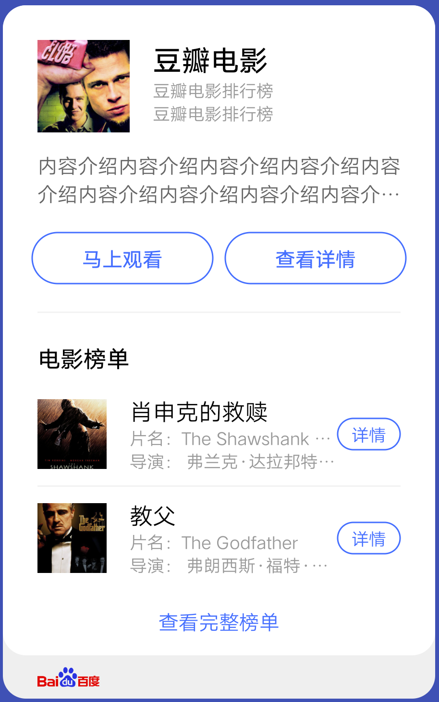
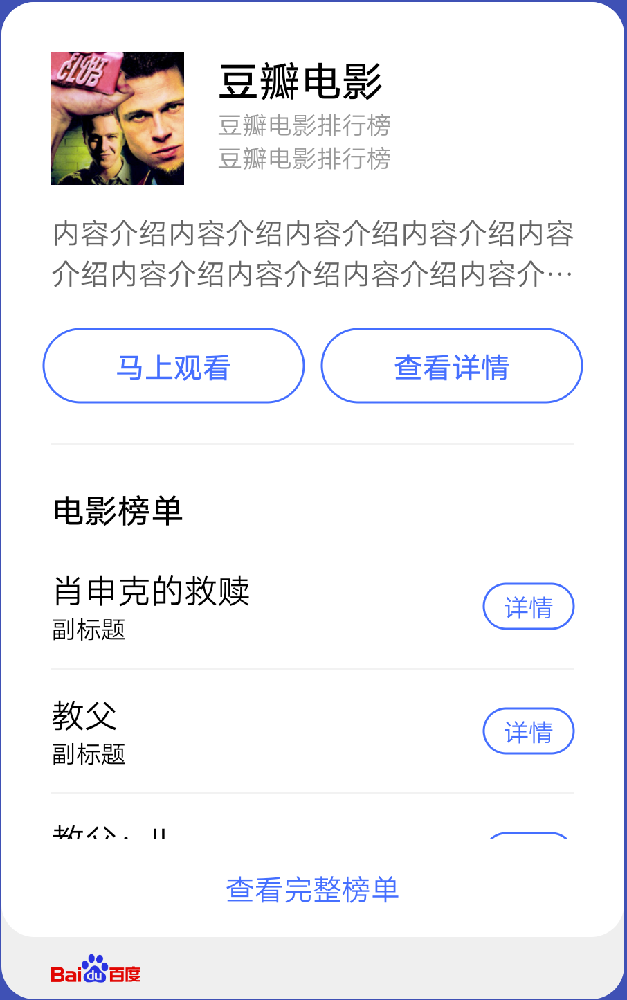
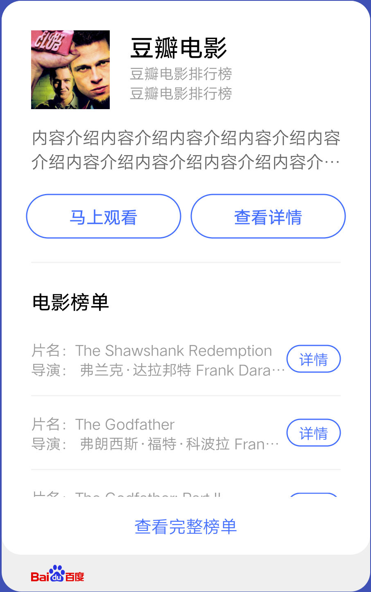
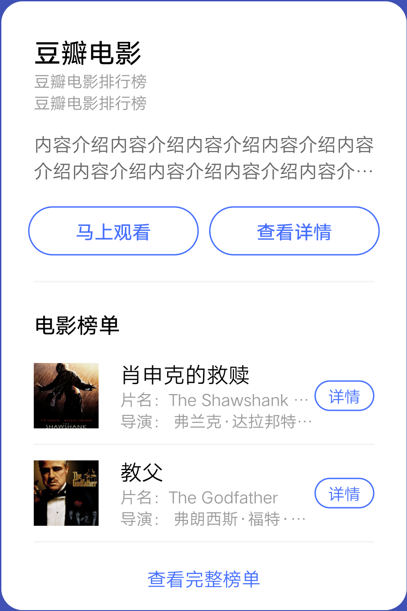

## 【模板】卡片模板 C

### 描述

复合功能卡片，可用于文本及列表按钮的复合信息展示

### 使用效果

<div style="text-align: center;margin: 40px;">




</div>

### 使用方法

在`.ux`文件中引入组件

```html
<import
  name="card-c"
  src="vivo-cards-suits/components/screen/card-template-c/index"
></import>
```

### 示例

```html
<template>
  <card-c
    image-url="http://posters.imdb.cn/upload/2016/08/22/zZYTGWIlI_1471858567.jpg"
    title="豆瓣电影"
    info1="豆瓣电影排行榜"
    info2="豆瓣电影排行榜"
    description="内容介绍内容介绍内容介绍内容介绍内容介绍内容介绍内容介绍内容介绍内容介绍内容介绍内容介绍内容介绍"
    buttons="{{buttons}}"
    list-title="电影榜单"
    list-type="A"
    list-data="{{listData}}"
    bottom="{{bottom}}"
    logo-url="https://www.baidu.com/img/baidu_resultlogo@2.png"
  ></card-c>
</template>
<script>
  export default {
    data() {
      return {
        buttons: [
          {
            text: "马上观看",
            url:
              "https://movie.douban.com/subject/27119724/?tag=%E7%83%AD%E9%97%A8&from=gaia"
          },
          {
            text: "查看详情",
            url:
              "https://movie.douban.com/subject/27119724/?tag=%E7%83%AD%E9%97%A8&from=gaia"
          }
        ],
        listData: [
          {
            image:
              "http://posters.imdb.cn/upload/2016/08/22/vNgaX4hhj_1471854359.jpg",
            title: "肖申克的救赎",
            info1: "片名：The Shawshank Redemption",
            info2: "导演： 弗兰克·达拉邦特 Frank Darabont） ",
            button: {
              text: "详情",
              url: "http://www.imdb.cn/title/tt0111161"
            }
          },
          {
            image:
              "http://posters.imdb.cn/upload/2016/08/26/NGiDp8KS3_1472192982.jpg",
            title: "教父",
            info1: "片名：The Godfather",
            info2: "导演： 弗朗西斯·福特·科波拉 Francis Ford Coppola）",
            button: {
              text: "详情",
              url: "http://www.imdb.cn/title/tt0068646"
            }
          },
          {
            image:
              "http://posters.imdb.cn/upload/1980/07/07/RgYKt147N_1180702311.jpg",
            title: "教父：II",
            info1: "片名：The Godfather: Part II",
            info2: "导演： 弗朗西斯·福特·科波拉 Francis Ford Coppola）",
            button: {
              text: "详情",
              url: "http://www.imdb.cn/title/tt0071562"
            }
          },
          {
            image:
              "http://posters.imdb.cn/upload/2003/03/08/1Bhi80Jxx_1177989811.jpg",
            title: "低俗小说",
            info1: "片名：The Shawshank Redemption",
            info2: "导演： 弗兰克·达拉邦特 Frank Darabont） ",
            button: {
              text: "详情",
              url: "http://www.imdb.cn/title/tt0111161"
            }
          },
          {
            image:
              "http://posters.imdb.cn/upload/1999/03/29/62RLIR9saC_1148432357.jpg",
            title: "黄金三镖客",
            info1: "片名：The Shawshank Redemption",
            info2: "导演： 弗兰克·达拉邦特 Frank Darabont） ",
            button: {
              text: "详情",
              url: "http://www.imdb.cn/title/tt0111161"
            }
          }
        ],
        bottom: {
          text: "查看完整榜单",
          url: "https://www.google.com"
        }
      };
    }
  };
</script>
```

### API

| 属性        | 类型   | 默认值 | 说明                                                    |
| ----------- | ------ | ------ | ------------------------------------------------------- |
| imageUrl    | string | -      | 标题图片地址，支持 base64，不传则不显示                 |
| title       | string | -      | 标题                                                    |
| info1       | string | -      | 辅助信息                                                |
| info2       | string | -      | 辅助信息                                                |
| description | string | -      | 详情文本                                                |
| listTitle   | string | -      | 列表标题，不传则不显示                                  |
| listType    | string | 'A'    | 列表显示类型，可选值有'A','B','C','D'。对应四个列表组件 |
| listData    | array  | []     | 列表数据，元素属性参考对应的列表组件                    |
| logoUrl     | string | -      | 底部 logo 地址，支持 base64，不传则不显示底部           |
| buttons     | array  | []     | 底部按钮组，最大支持三个按钮，最少一个                  |
| button.text | string | '按钮' | 按钮组单个按钮文本                                      |
| button.url  | string | -      | 按钮组单个按钮文本，点击后跳转地址                      |
| bottom      | object | -      | 底部按钮对象                                            |
| bottom.text | string | -      | 底部按钮文本，点击后跳转地址                            |
| bottom.url  | string | -      | 底部按钮文本，点击后跳转地址                            |
