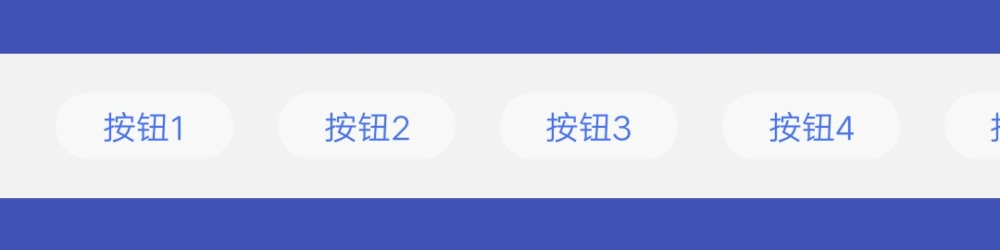
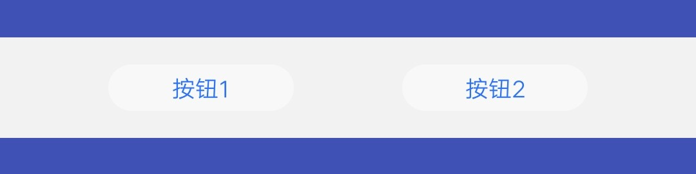
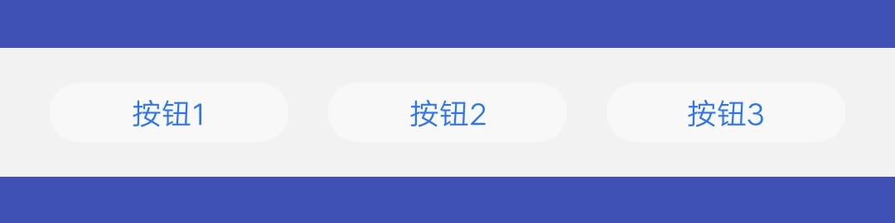
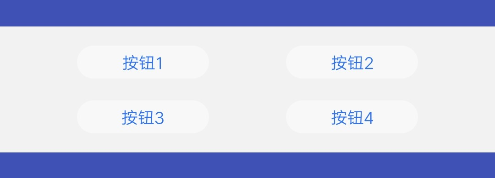
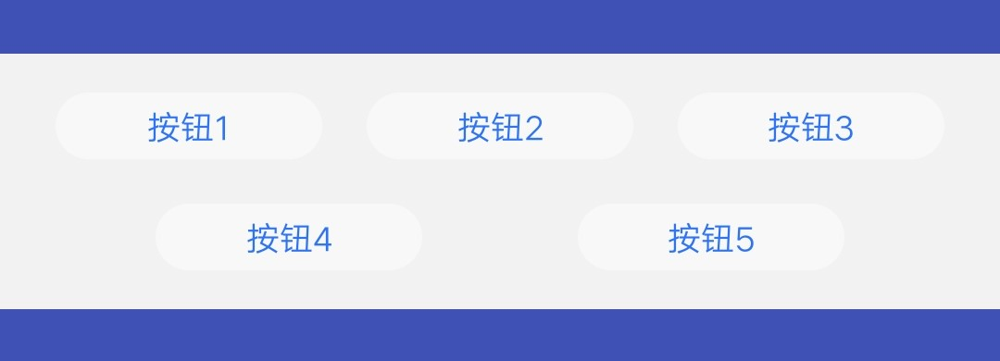

## 【组件】 按钮组件

### 描述

全局搜索卡片按钮组件

### 使用效果

<div style="text-align: center;margin: 40px;">
  
</div>
<div style="text-align: center;margin: 40px;">
  
  
  
</div>
<div style="text-align: center;margin: 40px;">
  
  
  
</div>

### 使用方法

在`.ux`文件中引入组件

```html
<import
  name="text-a"
  src="vivo-cards-suits/components/search/components/button.ux"
></import>
```

### 示例

```html
<template>
  <div class="card">
    <component-button
      layout="{{layout}}"
      button-list="{{buttonList}}"
      onclicked="handleClickBtn"
    ></component-button>
  </div>
</template>

<script>
  export default {
    data() {
      return {
        layout: "row", // row, column
        buttonList: [
          "按钮1",
          "按钮2",
          "按钮3",
          "按钮4",
          "按钮5",
          "按钮6",
          "按钮7",
          "按钮8",
          "按钮9",
          "按钮10"
        ]
      };
    },
    handleClickBtn(e) {
      console.log(`点击按钮, index: ${e.detail.index} text: ${e.detail.text}`);
    }
  };
</script>

<style lang="less">
  .card {
    width: 100%;
  }
</style>
```

### API

#### 组件属性

| 属性       | 类型   | 默认值 | 说明                                                                                       |
| ---------- | ------ | ------ | ------------------------------------------------------------------------------------------ |
| layout     | String | row    | 按钮排列类型, row: 横向滚动, 显示 1-10 个按钮; column: 纵向排列，3 个一行，显示 1-6 个按钮 |
| buttonList | Array  | -      | 按钮文字数组，按钮文字不超过 4 个字                                                        |

#### 组件事件

| 事件名称 | 事件描述     | 返回值                                |
| -------- | ------------ | ------------------------------------- |
| clicked  | 点击按钮触发 | {index: '按钮下标', text: '按钮文字'} |
