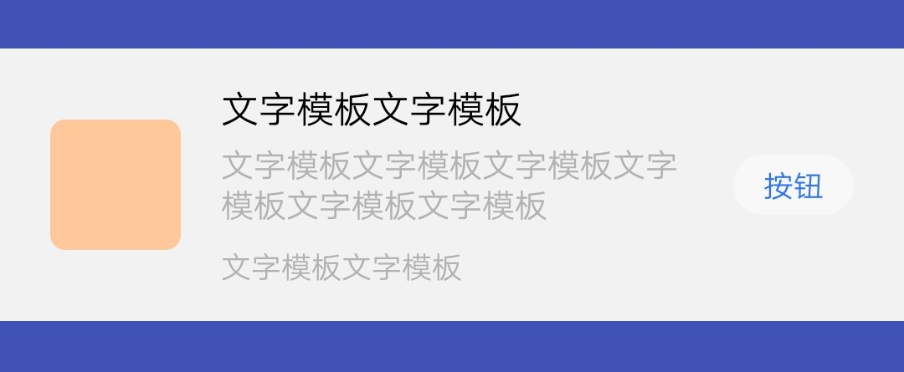
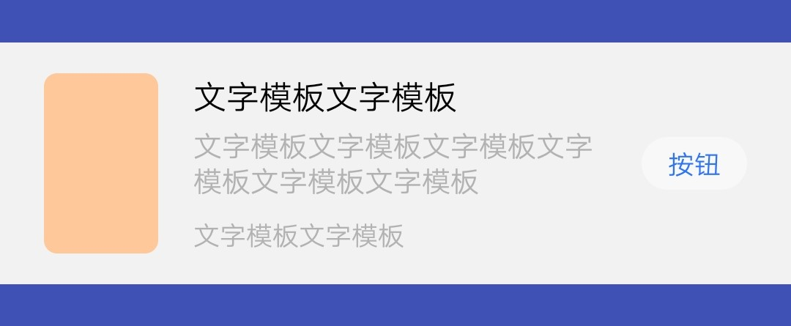
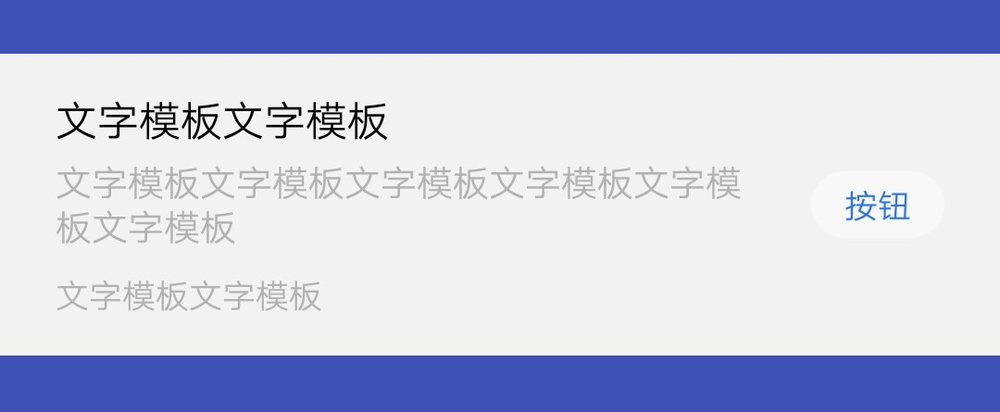
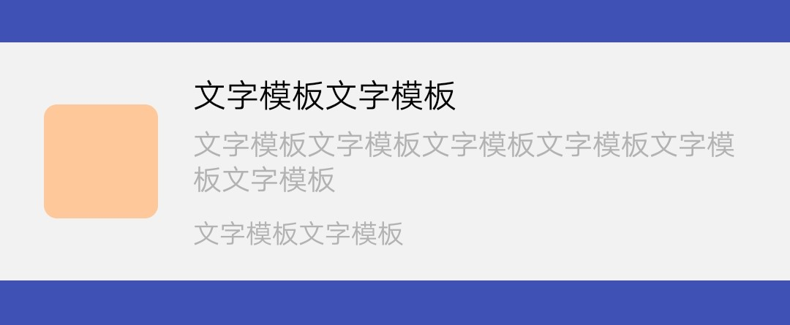

## 【组件】 组件 A

### 描述

全局搜索组件 A

### 使用效果

<div style="text-align: center;margin: 40px;">
  
  
  
  
</div>

### 使用方法

在`.ux`文件中引入组件

```html
<import
  name="component-a"
  src="vivo-cards-suits/components/search/component-a/index.ux"
></import>
```

### 示例

```html
<template>
  <div class="card">
    <component-a
      img-url="{{imgUrl}}"
      img-type="{{imgType}}"
      info1="{{info1}}"
      info2="{{info2}}"
      info3="{{info3}}"
      info1-lines="{{info1Lines}}"
      info2-lines="{{info2Lines}}"
      info3-lines="{{info3Lines}}"
      button="{{button}}"
      onclickbtn="handleClickBtn"
    ></component-a>
  </div>
</template>

<script>
  export default {
    data() {
      return {
        imgUrl: "imgUrl",
        imgType: "A", // A B
        info1: "文字模板文字模板",
        info2: "文字模板文字模板文字模板文字模板文字模板文字模板",
        info3: "文字模板文字模板",
        info1Lines: 2,
        info2Lines: 3,
        info3Lines: 1,
        button: "按钮"
      };
    },
    handleClickBtn() {
      console.log("点击按钮");
    }
  };
</script>

<style lang="less">
  .card {
    width: 100%;
  }
</style>
```

### API

#### 组件属性

| 属性       | 类型   | 默认值 | 说明                                            |
| ---------- | ------ | ------ | ----------------------------------------------- |
| imgUrl     | String | -      | 图片地址，支持 base64，不传则不显示             |
| imgType    | String | A      | 图片样式，可选值：A，B                          |
| info1      | String | -      | 标题文字，不传则不显示                          |
| info2      | String | -      | 次要文字，不传则不显示                          |
| info3      | String | -      | 说明文字，不传则不显示                          |
| info1Lines | Number | 2      | 标题文字显示行数，超过显示...                   |
| info2Lines | Number | 3      | 次要文字显示行数，超过显示...                   |
| info3Lines | Number | 1      | 说明文字显示行数，超过显示...                   |
| button     | String | -      | 按钮文字，按钮文字不超过 2 个，不传则不显示按钮 |

#### 组件事件

| 事件名称 | 事件描述     | 返回值 |
| -------- | ------------ | ------ |
| clickbtn | 点击按钮触发 | -      |
