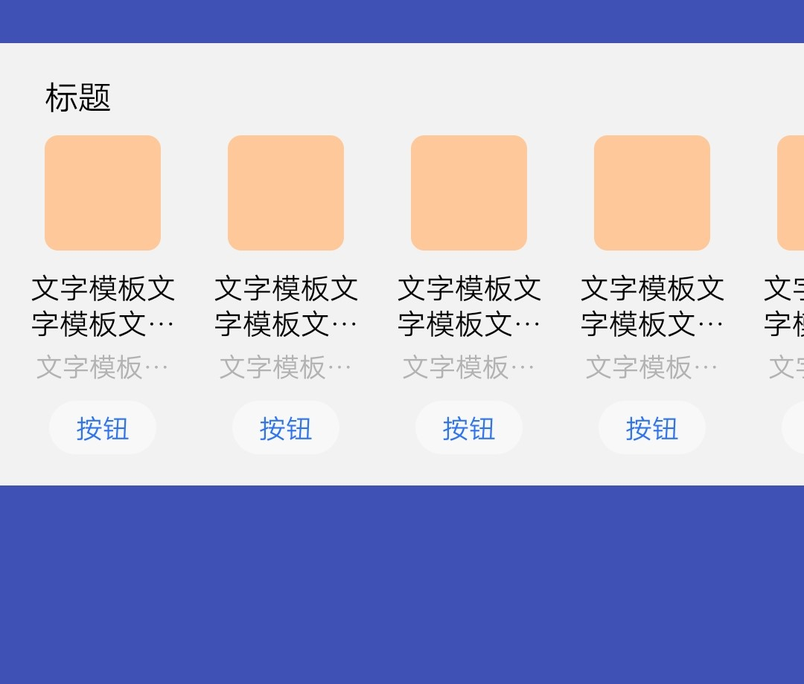
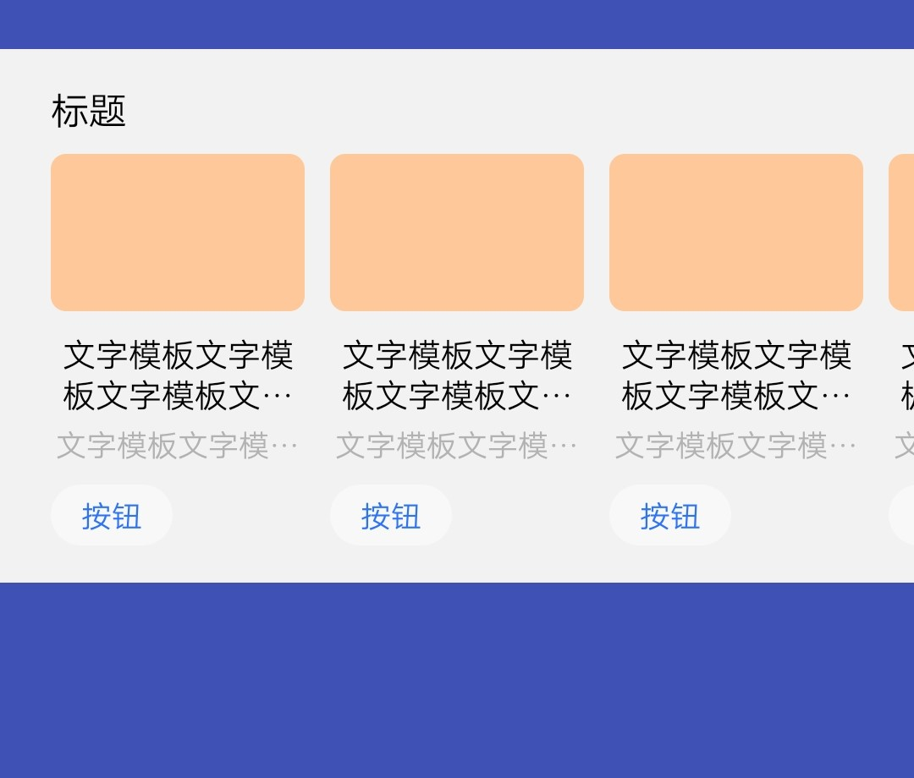
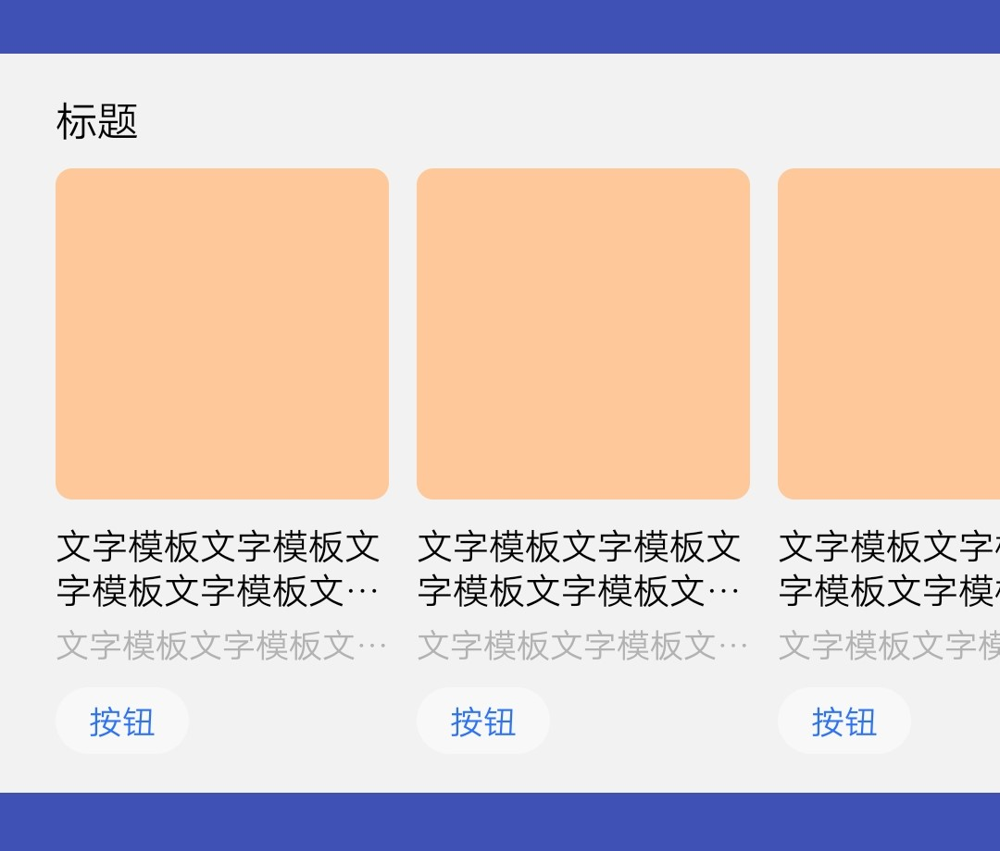
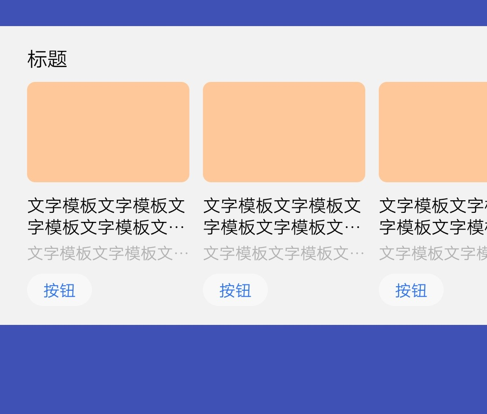

## 【模板】 卡片模板 B

### 描述

全局搜索卡片模板 B

### 使用效果

<div style="text-align: center;margin: 40px;">
  
  
  
  
</div>

### 使用方法

在`.ux`文件中引入组件

```html
<import
  name="component-b"
  src="vivo-cards-suits/components/search/component-b/index.ux"
></import>
```

### 示例

```html
<template>
  <div class="card">
    <component-b
      title="{{title}}"
      list-type="{{listType}}"
      list-data="{{listData}}"
      info1Lines="{{info1Lines}}"
      info2Lines="{{info2Lines}}"
      button="{{button}}"
      onclickbtn="handleClickBtn"
    ></component-b>
  </div>
</template>

<script>
  export default {
    data() {
      return {
        title: "标题",
        listType: "A", // A B C D
        listData: [
          {
            imgUrl: "imgUrl",
            info1: "文字模板文字模板文字模板文字模板文字模板文字模板",
            info2: "文字模板文字模板文字模板文字模板文字模板文字模板"
          },
          {
            imgUrl: "imgUrl",
            info1: "文字模板文字模板文字模板文字模板文字模板文字模板",
            info2: "文字模板文字模板文字模板文字模板文字模板文字模板"
          },
          {
            imgUrl: "imgUrl",
            info1: "文字模板文字模板文字模板文字模板文字模板文字模板",
            info2: "文字模板文字模板文字模板文字模板文字模板文字模板"
          },
          {
            imgUrl: "imgUrl",
            info1: "文字模板文字模板文字模板文字模板文字模板文字模板",
            info2: "文字模板文字模板文字模板文字模板文字模板文字模板"
          },
          {
            imgUrl: "imgUrl",
            info1: "文字模板文字模板文字模板文字模板文字模板文字模板",
            info2: "文字模板文字模板文字模板文字模板文字模板文字模板"
          },
          {
            imgUrl: "imgUrl",
            info1: "文字模板文字模板文字模板文字模板文字模板文字模板",
            info2: "文字模板文字模板文字模板文字模板文字模板文字模板"
          },
          {
            imgUrl: "imgUrl",
            info1: "文字模板文字模板文字模板文字模板文字模板文字模板",
            info2: "文字模板文字模板文字模板文字模板文字模板文字模板"
          },
          {
            imgUrl: "imgUrl",
            info1: "文字模板文字模板文字模板文字模板文字模板文字模板",
            info2: "文字模板文字模板文字模板文字模板文字模板文字模板"
          },
          {
            imgUrl: "imgUrl",
            info1: "文字模板文字模板文字模板文字模板文字模板文字模板",
            info2: "文字模板文字模板文字模板文字模板文字模板文字模板"
          },
          {
            imgUrl: "imgUrl",
            info1: "文字模板文字模板文字模板文字模板文字模板文字模板",
            info2: "文字模板文字模板文字模板文字模板文字模板文字模板"
          }
        ],
        info1Lines: 2,
        info2Lines: 1,
        button: "按钮"
      };
    },
    handleClickBtn(e) {
      console.log(`点击按钮，index: ${e.detail.index}`);
    }
  };
</script>

<style lang="less">
  .card {
    width: 100%;
  }
</style>
```

### API

#### 组件属性

| 属性            | 类型   | 默认值 | 说明                                            |
| --------------- | ------ | ------ | ----------------------------------------------- |
| title           | String | -      | 标题，最多显示一行，超过显示...                 |
| listType        | String | A      | 列表样式，可选值：A，B，C，D                    |
| listData        | Array  | -      | 列表数据，最多显示 10 个数据                    |
| listData.imgUrl | String | -      | 图片地址，支持 base64，不传则不显示             |
| listData.info1  | String | -      | 次要文字，不传则不显示                          |
| listData.info2  | String | -      | 说明文字，不传则不显示                          |
| info1Lines      | Number | 2      | 次要文字显示行数，超过显示...                   |
| info2Lines      | Number | 1      | 说明文字显示行数，超过显示...                   |
| button          | String | -      | 按钮文字，按钮文字不超过 2 个，不传则不显示按钮 |

#### 组件事件

| 事件名称 | 事件描述     | 返回值              |
| -------- | ------------ | ------------------- |
| clickbtn | 点击按钮触发 | {index: '按钮下标'} |
