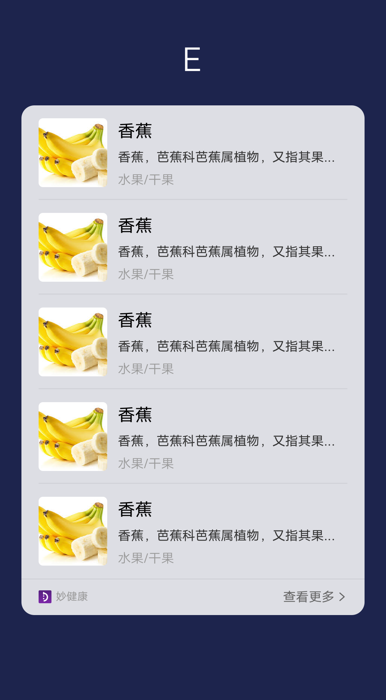

## 【组件】 列表模板组件 E

### 描述

左图 + 标题 + 标签文字 + 辅助信息

### 使用效果

<div style="text-align: center;margin: 40px;">
  
</div>

### 使用方法

在`.ux`文件中引入组件

```html
<import
  name="list-item-e"
  src="vivo-cards-suits/components/voice/components/list-item-e.ux"
></import>
```

### 示例

```html
<template>
  <div class="card">
    <div class="list">
      <div
        class="list-item-wrap {{$idx!==0?'border-top':''}}"
        for="{{listData.slice(0,5)}}"
      >
        <list-item-e
          title="{{$item.title}}"
          info1Lines="{{$item.info1Lines}}"
          info1="{{$item.info1}}"
          info2="{{$item.info2}}"
          img-type="{{imgType}}"
          img-url="{{$item.imgUrl}}"
          img-resize-mode="{{imgResizeMode}}"
          img-object-fit="{{imgObjectFit}}"
        ></list-item-e>
      </div>
    </div>
  </div>
</template>

<script>
  import router from "@system.router";

  export default {
    data() {
      return {
        listData: [
          {
            title: "标题",
            info1Lines: 1,
            info1: "标签文字",
            info2: "辅助文字",
            imgUrl: ""
          },
          {
            title: "标题",
            info1Lines: 1,
            info1: "标签文字",
            info2: "辅助文字",
            imgUrl: ""
          },
          {
            title: "标题",
            info1Lines: 1,
            info1: "标签文字",
            info2: "辅助文字",
            imgUrl: ""
          },
          {
            title: "标题",
            info1Lines: 1,
            info1: "标签文字",
            info2: "辅助文字",
            imgUrl: ""
          },
          {
            title: "标题",
            info1Lines: 1,
            info1: "标签文字",
            info2: "辅助文字",
            imgUrl: ""
          }
        ],
        imgType: "B", // A: 144*108 B: 128*128
        imgResizeMode: "cover",
        imgObjectFit: "cover"
      };
    }
  };
</script>

<style lang="less">
  .border-top {
    border-top: 2px solid rgba(0, 0, 0, 0.05);
  }

  .card {
    width: 100%;
    flex-direction: column;
    .list {
      flex-direction: column;
      padding: 0 32px;
    }
  }
</style>
```

### API

#### 组件属性

| 属性          | 类型   | 默认值  | 说明                                                   |
| ------------- | ------ | ------- | ------------------------------------------------------ |
| title         | String | -       | 标题                                                   |
| info1Lines    | Number | 1       | 标签文字行数，可选值：1，2                             |
| info1         | String | -       | 浏览点赞数量，                                         |
| imgType       | String | B       | 图片的尺寸类型，A: 144\*108 B: 128\*128                |
| imgUrl        | String | -       | 图片地址，支持 base64                                  |
| imgResizeMode | String | 'cover' | 图片的缩放类型：cover，contain，stretch，center        |
| imgObjectFit  | String | 'cover' | 图片的缩放类型：contain，cover，fill，none，scale-down |
