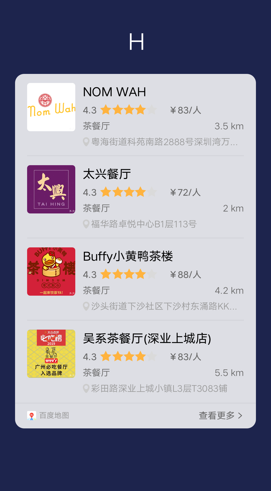

## 【组件】 列表模板组件 H

### 描述

左图 + 标题 + 评分 + 辅助信息

### 使用效果

<div style="text-align: center;margin: 40px;">
  
</div>

### 使用方法

在`.ux`文件中引入组件

```html
<import
  name="list-item-g"
  src="vivo-cards-suits/components/voice/components/list-item-h.ux"
></import>
```

### 示例

```html
<template>
  <div class="card">
    <div class="list">
      <div
        class="list-item-wrap {{$idx!==0?'border-top':''}}"
        for="{{listData.slice(0,4)}}"
      >
        <list-item-h
          title="{{$item.title}}"
          gradeNumber="{{$item.gradeNumber}}"
          info1="{{$item.info1}}"
          info2="{{$item.info2}}"
          info2Icon="{{$item.info2Icon}}"
          img-type="{{imgType}}"
          img-url="{{$item.imgUrl}}"
          img-resize-mode="{{imgResizeMode}}"
          img-object-fit="{{imgObjectFit}}"
        ></list-item-h>
      </div>
    </div>
  </div>
</template>

<script>
  import router from "@system.router";

  export default {
    data() {
      return {
        listData: [
          {
            title: "标题",
            gradeNumber: 3.5,
            info1: ["标签文字1", "标签文字2"],
            info2: "辅助文本",
            info2Icon: {
              src:
                "data:image/png;base64,UklGRiYCAABXRUJQVlA4TBoCAAAvI8ALEB+DIJJtLPp3FMR3NRA2koxB/z0qxFuEjSRj0H+PCvHWcWTbpvUu9vs2pj8EB/Dzj+LPbRzcHaiqdO/Fe49ozAxnhhB0Uf//Ub0qwQiogHcFAB0cqkGFSqBQKG5wEISjwFHgEAh+OEJgIAx3EAbFG18oPvhA1loO4gviC+Kz1nIQHQBAQEYHAAAsqhYSgBESAjKAgCHaAIAWAjJCtcOgYrU859To7L1ztUeambkCgm3thaS0u8e2bbvHtm3sfxVd35+/ZgX5koj+T4ARl+9N/Qw90vmwV26UiyOd7UL6osb7TbB23iYxE1SZEDWMtiuPUtBw267OBpAYbY9xlFEz7bEy4i0In062qpLlrwe/kvBWciM4aTFw41ZwY8higJ3LRpoZR8EbjqB9ynPDaMTkO8GksS30gc78Xnv0c7MV50HYOwUTxr6tC5z+gB0FjgI/BOo0ZsHQI8hqLIDH7v/QfQ+qNWbB/TDY1bgAw8fgTKGtCxyvgJdGu692uJrviApnVi19wOXNFQgfFrmbdnhFHqLORVH6POBDsgmFcFqD1v/ahU0kfwWh53StqaK1/vO6XfprSG5LdH1JYjAexxIexeMYme+Joycfxdk4PGFDv54n4qHeIYWpOy2fknBVy1E+puNo2dyr4ZptuKThaX9p56lY9mDjKjW42SFzNLofsg9qz0k89b8RTZx7TyXcM/HWTg8EV0tb",
              width: "18",
              height: "24"
            },
            imgUrl: ""
          },
          {
            title: "标题",
            gradeNumber: 3.5,
            info1: ["标签文字1", "标签文字2"],
            info2: "辅助文本",
            info2Icon: {
              src:
                "data:image/png;base64,UklGRiYCAABXRUJQVlA4TBoCAAAvI8ALEB+DIJJtLPp3FMR3NRA2koxB/z0qxFuEjSRj0H+PCvHWcWTbpvUu9vs2pj8EB/Dzj+LPbRzcHaiqdO/Fe49ozAxnhhB0Uf//Ub0qwQiogHcFAB0cqkGFSqBQKG5wEISjwFHgEAh+OEJgIAx3EAbFG18oPvhA1loO4gviC+Kz1nIQHQBAQEYHAAAsqhYSgBESAjKAgCHaAIAWAjJCtcOgYrU859To7L1ztUeambkCgm3thaS0u8e2bbvHtm3sfxVd35+/ZgX5koj+T4ARl+9N/Qw90vmwV26UiyOd7UL6osb7TbB23iYxE1SZEDWMtiuPUtBw267OBpAYbY9xlFEz7bEy4i0In062qpLlrwe/kvBWciM4aTFw41ZwY8higJ3LRpoZR8EbjqB9ynPDaMTkO8GksS30gc78Xnv0c7MV50HYOwUTxr6tC5z+gB0FjgI/BOo0ZsHQI8hqLIDH7v/QfQ+qNWbB/TDY1bgAw8fgTKGtCxyvgJdGu692uJrviApnVi19wOXNFQgfFrmbdnhFHqLORVH6POBDsgmFcFqD1v/ahU0kfwWh53StqaK1/vO6XfprSG5LdH1JYjAexxIexeMYme+Joycfxdk4PGFDv54n4qHeIYWpOy2fknBVy1E+puNo2dyr4ZptuKThaX9p56lY9mDjKjW42SFzNLofsg9qz0k89b8RTZx7TyXcM/HWTg8EV0tb",
              width: "18",
              height: "24"
            },
            imgUrl: ""
          },
          {
            title: "标题",
            gradeNumber: 3.5,
            info1: ["标签文字1", "标签文字2"],
            info2: "辅助文本",
            info2Icon: {
              src:
                "data:image/png;base64,UklGRiYCAABXRUJQVlA4TBoCAAAvI8ALEB+DIJJtLPp3FMR3NRA2koxB/z0qxFuEjSRj0H+PCvHWcWTbpvUu9vs2pj8EB/Dzj+LPbRzcHaiqdO/Fe49ozAxnhhB0Uf//Ub0qwQiogHcFAB0cqkGFSqBQKG5wEISjwFHgEAh+OEJgIAx3EAbFG18oPvhA1loO4gviC+Kz1nIQHQBAQEYHAAAsqhYSgBESAjKAgCHaAIAWAjJCtcOgYrU859To7L1ztUeambkCgm3thaS0u8e2bbvHtm3sfxVd35+/ZgX5koj+T4ARl+9N/Qw90vmwV26UiyOd7UL6osb7TbB23iYxE1SZEDWMtiuPUtBw267OBpAYbY9xlFEz7bEy4i0In062qpLlrwe/kvBWciM4aTFw41ZwY8higJ3LRpoZR8EbjqB9ynPDaMTkO8GksS30gc78Xnv0c7MV50HYOwUTxr6tC5z+gB0FjgI/BOo0ZsHQI8hqLIDH7v/QfQ+qNWbB/TDY1bgAw8fgTKGtCxyvgJdGu692uJrviApnVi19wOXNFQgfFrmbdnhFHqLORVH6POBDsgmFcFqD1v/ahU0kfwWh53StqaK1/vO6XfprSG5LdH1JYjAexxIexeMYme+Joycfxdk4PGFDv54n4qHeIYWpOy2fknBVy1E+puNo2dyr4ZptuKThaX9p56lY9mDjKjW42SFzNLofsg9qz0k89b8RTZx7TyXcM/HWTg8EV0tb",
              width: "18",
              height: "24"
            },
            imgUrl: ""
          },
          {
            title: "标题",
            gradeNumber: 3.5,
            info1: ["标签文字1", "标签文字2"],
            info2: "辅助文本",
            info2Icon: {
              src:
                "data:image/png;base64,UklGRiYCAABXRUJQVlA4TBoCAAAvI8ALEB+DIJJtLPp3FMR3NRA2koxB/z0qxFuEjSRj0H+PCvHWcWTbpvUu9vs2pj8EB/Dzj+LPbRzcHaiqdO/Fe49ozAxnhhB0Uf//Ub0qwQiogHcFAB0cqkGFSqBQKG5wEISjwFHgEAh+OEJgIAx3EAbFG18oPvhA1loO4gviC+Kz1nIQHQBAQEYHAAAsqhYSgBESAjKAgCHaAIAWAjJCtcOgYrU859To7L1ztUeambkCgm3thaS0u8e2bbvHtm3sfxVd35+/ZgX5koj+T4ARl+9N/Qw90vmwV26UiyOd7UL6osb7TbB23iYxE1SZEDWMtiuPUtBw267OBpAYbY9xlFEz7bEy4i0In062qpLlrwe/kvBWciM4aTFw41ZwY8higJ3LRpoZR8EbjqB9ynPDaMTkO8GksS30gc78Xnv0c7MV50HYOwUTxr6tC5z+gB0FjgI/BOo0ZsHQI8hqLIDH7v/QfQ+qNWbB/TDY1bgAw8fgTKGtCxyvgJdGu692uJrviApnVi19wOXNFQgfFrmbdnhFHqLORVH6POBDsgmFcFqD1v/ahU0kfwWh53StqaK1/vO6XfprSG5LdH1JYjAexxIexeMYme+Joycfxdk4PGFDv54n4qHeIYWpOy2fknBVy1E+puNo2dyr4ZptuKThaX9p56lY9mDjKjW42SFzNLofsg9qz0k89b8RTZx7TyXcM/HWTg8EV0tb",
              width: "18",
              height: "24"
            },
            imgUrl: ""
          }
        ],
        imgType: "B", // A: 144*108 B: 128*128
        imgResizeMode: "cover",
        imgObjectFit: "cover"
      };
    }
  };
</script>

<style lang="less">
  .border-top {
    border-top: 2px solid rgba(0, 0, 0, 0.05);
  }

  .card {
    width: 100%;
    flex-direction: column;
    .list {
      flex-direction: column;
      padding: 0 32px;
    }
  }
</style>
```

### API

#### 组件属性

| 属性             | 类型   | 默认值  | 说明                                                   |
| ---------------- | ------ | ------- | ------------------------------------------------------ |
| title            | String | -       | 标题                                                   |
| gradeNumber      | Number | -       | 评分，stepsize=0.5                                     |
| info1            | Array  | -       | 标签文字，最多显示两个标签                             |
| info2            | String | -       | 辅助文本                                               |
| info2Icon        | Object | -       | 辅助文本前的图标配置，不传则不显示                     |
| info2Icon.src    | String | -       | icon 图片地址，支持 base64，不传则不显示               |
| info2Icon.width  | String | 24      | iocn 图标宽度                                          |
| info2Icon.height | String | 24      | icon 图标高度                                          |
| imgType          | String | B       | 图片的尺寸类型，A: 144\*108 B: 128\*128                |
| imgUrl           | String | -       | 图片地址，支持 base64                                  |
| imgResizeMode    | String | 'cover' | 图片的缩放类型：cover，contain，stretch，center        |
| imgObjectFit     | String | 'cover' | 图片的缩放类型：contain，cover，fill，none，scale-down |
