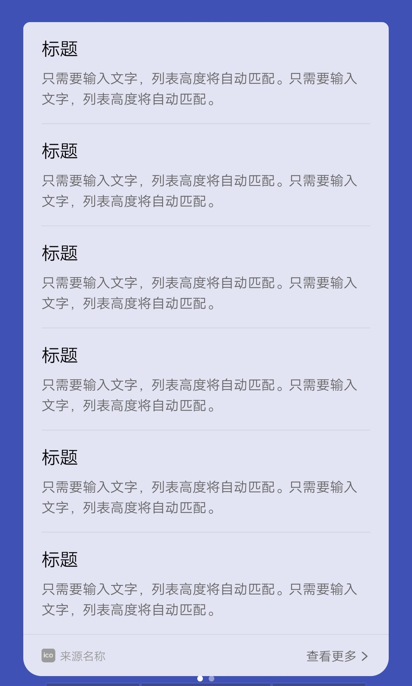

## 【组件】 列表组件 I

### 描述

标题 + 描述文字

### 使用效果

<div style="text-align: center;margin: 40px;">
  
</div>

### 使用方法

在`.ux`文件中引入组件

```html
<import
  name="list-item-i"
  src="vivo-cards-suits/components/voice/components/list-item-i.ux"
></import>
```

### 示例

```html
<template>
  <div class="card">
    <div class="list">
      <div
        class="list-item-wrap {{$idx!==0?'border-top':''}}"
        for="{{listData.slice(0,6)}}"
      >
        <list-item-i
          title="{{$item.title}}"
          content="{{$item.content}}"
        ></list-item-i>
      </div>
    </div>
  </div>
</template>

<script>
  import router from "@system.router";

  export default {
    data() {
      return {
        listData: [
          {
            title: "标题",
            content:
              "只需要输入文字，列表高度将自动匹配。只需要输入文字，列表高度将自动匹配。"
          },
          {
            title: "标题",
            content:
              "只需要输入文字，列表高度将自动匹配。只需要输入文字，列表高度将自动匹配。"
          },
          {
            title: "标题",
            content:
              "只需要输入文字，列表高度将自动匹配。只需要输入文字，列表高度将自动匹配。"
          },
          {
            title: "标题",
            content:
              "只需要输入文字，列表高度将自动匹配。只需要输入文字，列表高度将自动匹配。"
          },
          {
            title: "标题",
            content:
              "只需要输入文字，列表高度将自动匹配。只需要输入文字，列表高度将自动匹配。"
          },
          {
            title: "标题",
            content:
              "只需要输入文字，列表高度将自动匹配。只需要输入文字，列表高度将自动匹配。"
          }
        ]
      };
    }
  };
</script>

<style lang="less">
  .border-top {
    border-top: 2px solid rgba(0, 0, 0, 0.05);
  }

  .card {
    width: 100%;
    flex-direction: column;
    .list {
      flex-direction: column;
      padding: 0 32px;
    }
  }
</style>
```

### API

#### 组件属性

| 属性    | 类型   | 默认值 | 说明     |
| ------- | ------ | ------ | -------- |
| title   | String | -      | 标题     |
| content | String | -      | 描述文字 |
