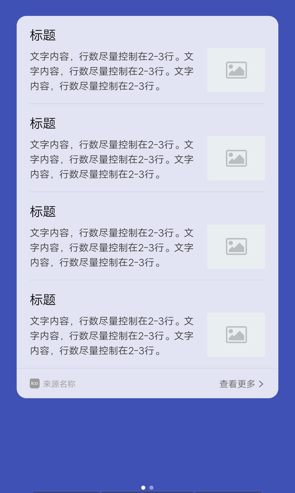
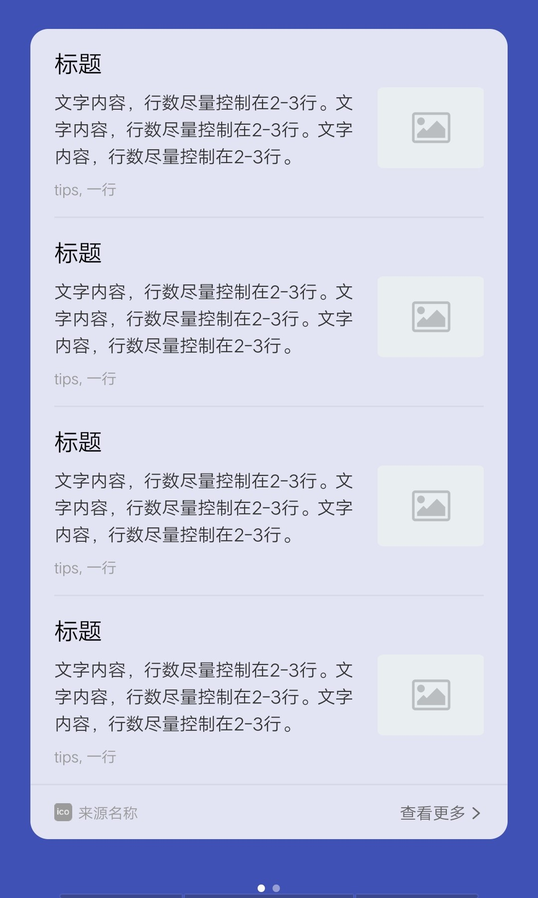
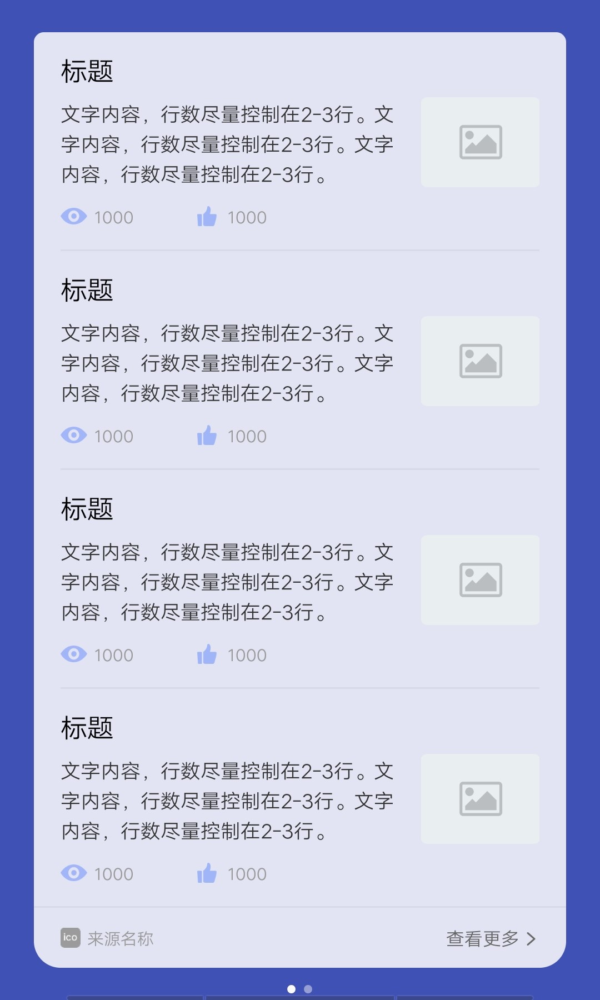
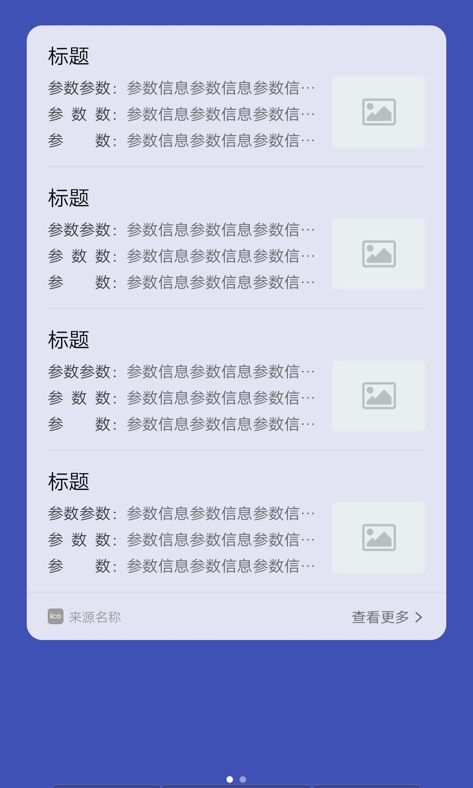
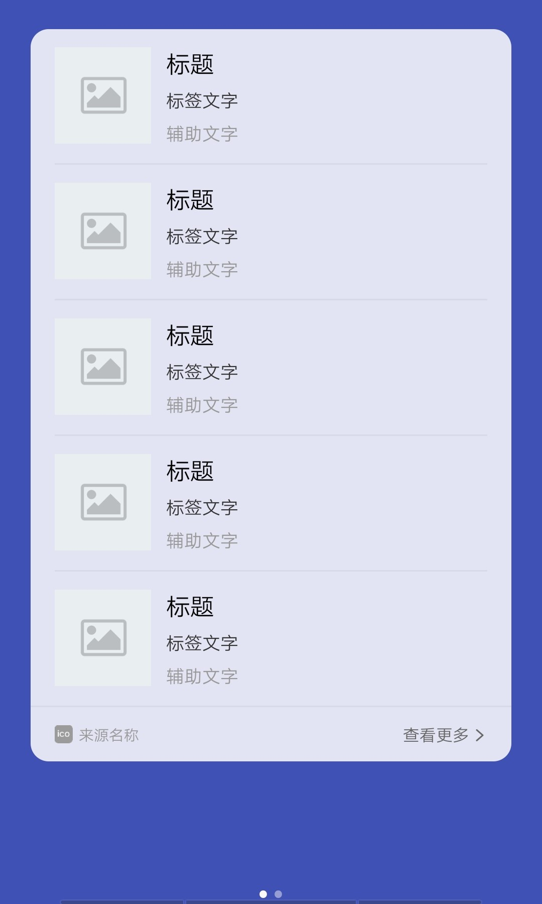
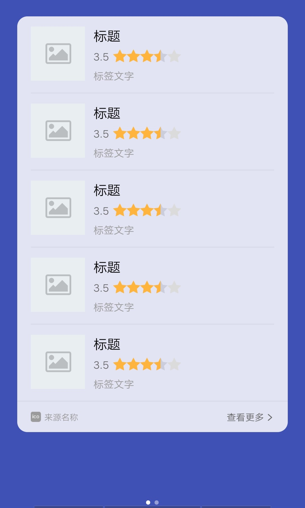
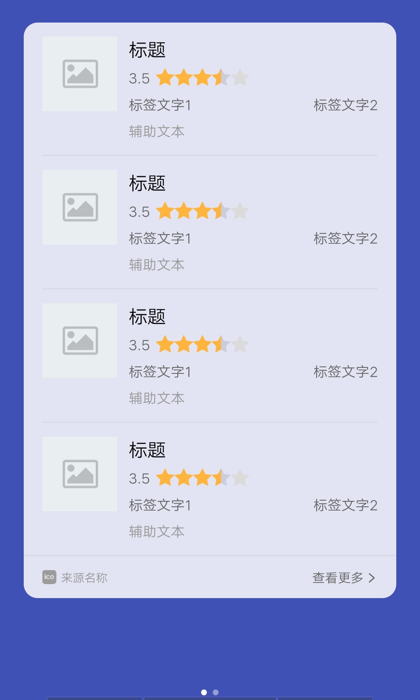

## 【模板】 列表模板

### 描述

jovi 语音列表卡片模板

### 使用效果

<div style="text-align: center;margin: 40px;">
  
  
  
  
  
  
  
  
  
</div>

### 使用方法

在`.ux`文件中引入组件

```html
<import
  name="card-list"
  src="vivo-cards-suits/voice/card-list/index.ux"
></import>
```

### 示例

```html
<template>
  <div class="card">
    <card-list
      list-type="{{listType}}"
      list-data="{{listData}}"
      sign-name="{{signName}}"
      sign-url="{{signUrl}}"
      skip-link="{{skipLink}}"
      img-resize-mode="{{imgResizeMode}}"
      img-object-fit="{{imgObjectFit}}"
      onclickmore="handleClickMore"
    ></card-list>
  </div>
</template>

<script>
  import router from "@system.router";

  export default {
    data() {
      return {
        listType: "A", // A-I
        listData: [{}, {}, {}, {}, {}, {}], // A模板数据
        signName: "来源名称",
        signUrl: "",
        skipLink: "https://www.quickapp.cn/",
        imgResizeMode: "cover",
        imgObjectFit: "cover"
      };
    },
    handleClickMore() {
      console.log(`点击查看更多 url: ${this.skipLink}`);

      router.push({
        uri: this.skipLink
      });
    }
  };
</script>

<style lang="less">
  .card {
    width: 100%;
  }
</style>
```

### API

#### 组件属性

| 属性          | 类型   | 默认值     | 说明                                                   |
| ------------- | ------ | ---------- | ------------------------------------------------------ |
| listType      | String | 'A'        | 模板类型，可选值 A-I                                   |
| listData      | Array  | []         | 列表数据，元素属性参考对应的列表组件                   |
| signName      | String | '来源名称' | 底部来源名称                                           |
| signUrl       | String | -          | 底部 logo 地址，支持 base64                            |
| skipName      | String | '查看更多' | 底部按钮名称                                           |
| skipLink      | String | -          | 底部按钮链接                                           |
| imgResizeMode | String | 'cover'    | 图片的缩放类型，cover，contain，stretch， center       |
| imgObjectFit  | String | 'cover'    | 图片的缩放类型，contain，cover，fill，none，scale-down |
