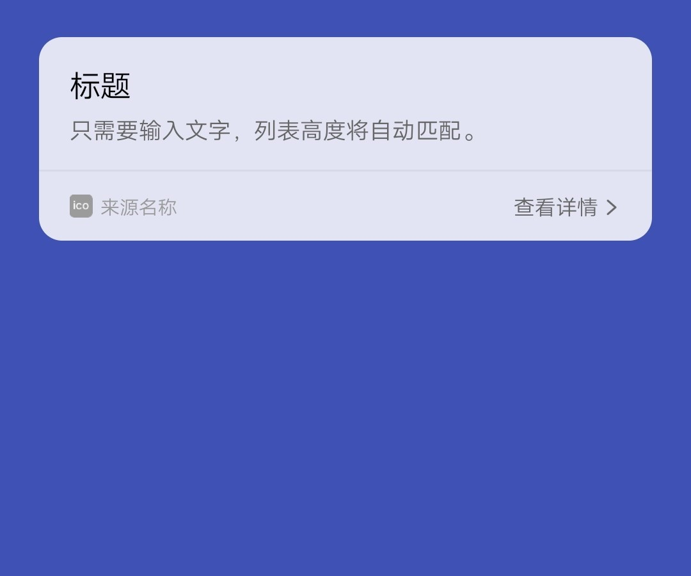

## 【组件】 模板组件 B

### 描述

标题 + 副标题

### 使用效果

<div style="text-align: center;margin: 40px;">
  
</div>

### 使用方法

在`.ux`文件中引入组件

```html
<import
  name="template-b"
  src="vivo-cards-suits/components/voice/components/template-b.ux"
></import>
```

### 示例

```html
<template>
  <div class="card">
    <template-b title="{{title}}" subtitle="{{subtitle}}"></template-b>
  </div>
</template>

<script>
  export default {
    data() {
      return {
        title: "标题",
        subtitle: "只需要输入文字，列表高度将自动匹配。"
      };
    }
  };
</script>

<style lang="less">
  .card {
    width: 100%;
    flex-direction: column;
  }
</style>
```

### API

#### 组件属性

| 属性     | 类型   | 默认值 | 说明   |
| -------- | ------ | ------ | ------ |
| title    | String | -      | 标题   |
| subtitle | String | -      | 副标题 |
