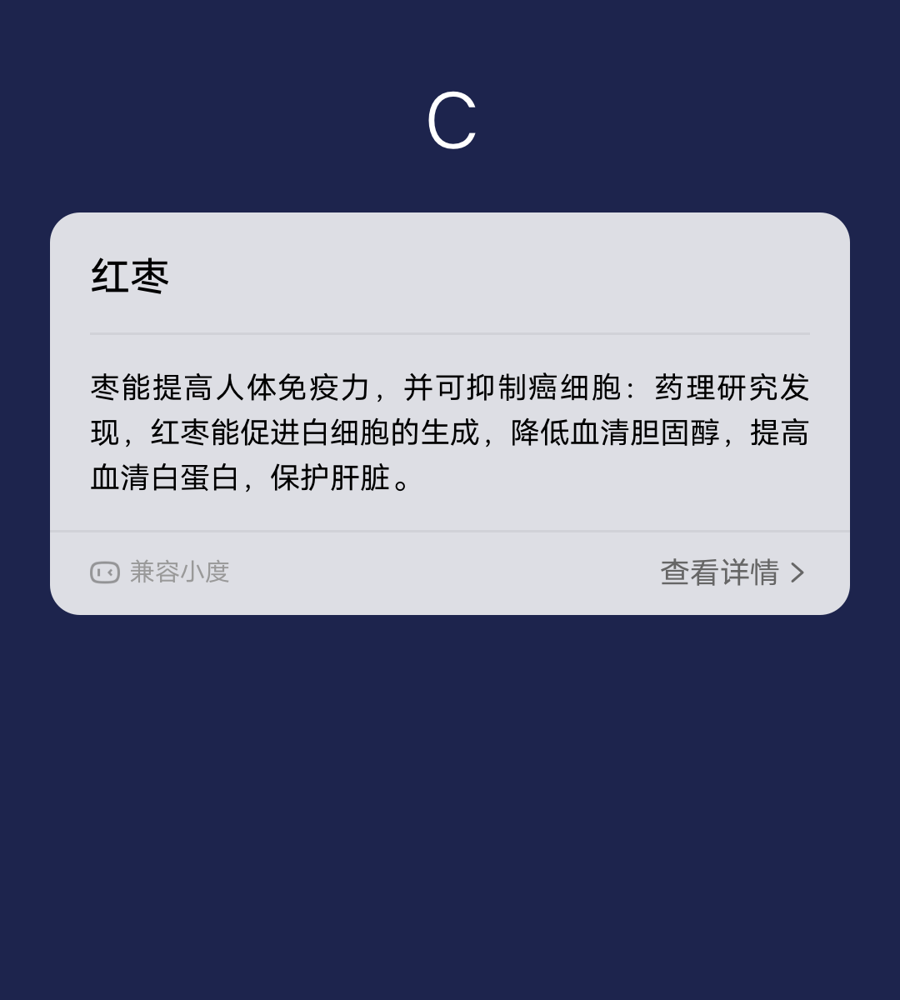

## 【组件】 卡片模板组件 C

### 描述

标题 + 正文

### 使用效果

<div style="text-align: center;margin: 40px;">
  
</div>

### 使用方法

在`.ux`文件中引入组件

```html
<import
  name="template-c"
  src="vivo-cards-suits/components/voice/components/template-c.ux"
></import>
```

### 示例

```html
<template>
  <div class="card">
    <template-c title="{{title}}" content="{{content}}"></template-c>
  </div>
</template>

<script>
  export default {
    data() {
      return {
        title: "标题",
        content:
          "卡片内容，卡片内容无限折行，不超过最大卡片高度，内容行数2行以上。"
      };
    }
  };
</script>

<style lang="less">
  .card {
    width: 100%;
    flex-direction: column;
  }
</style>
```

### API

#### 组件属性

| 属性    | 类型   | 默认值 | 说明 |
| ------- | ------ | ------ | ---- |
| title   | String | -      | 标题 |
| content | String | -      | 正文 |
