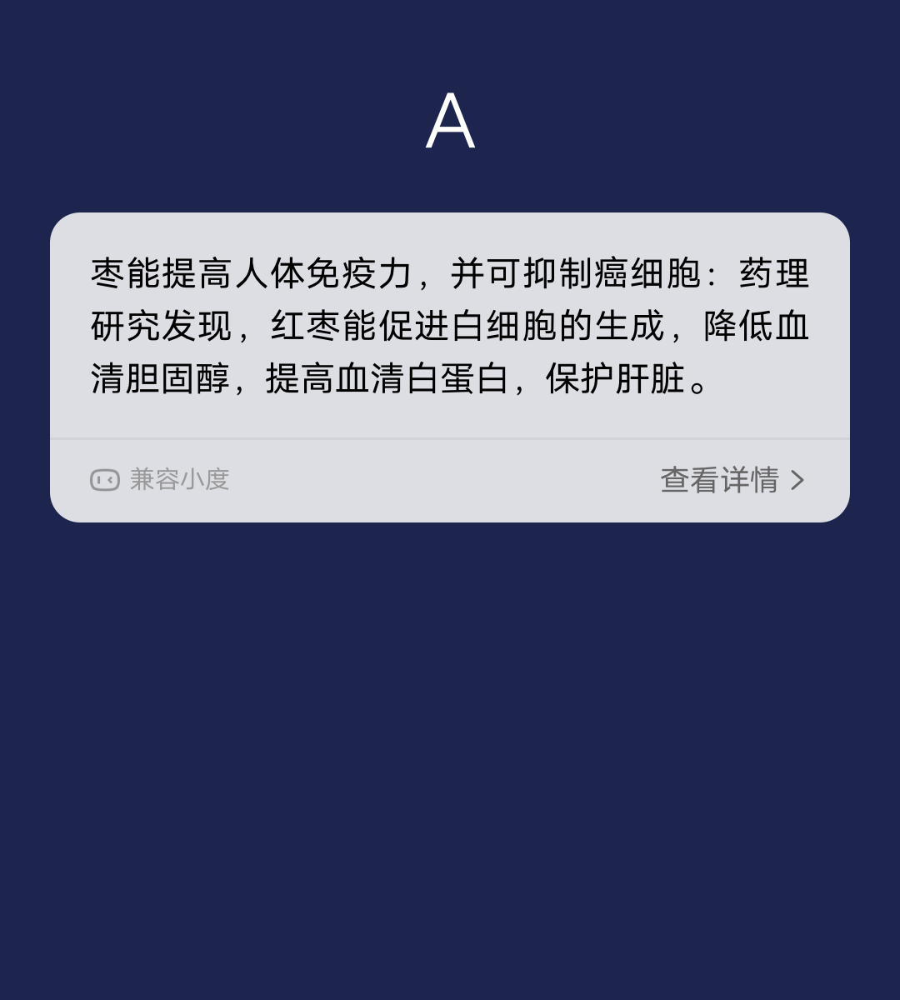
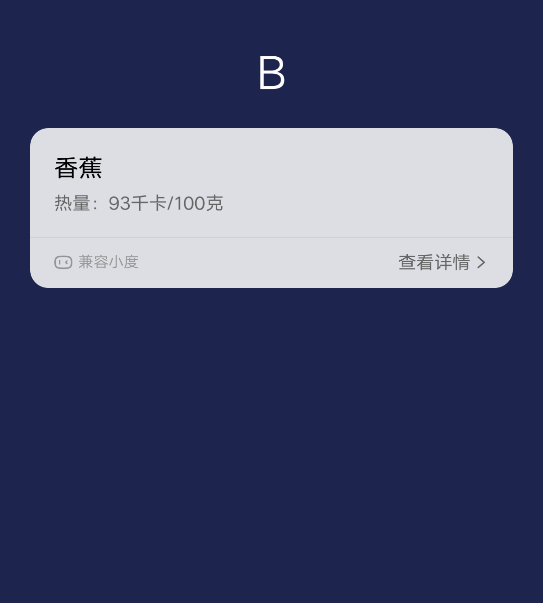
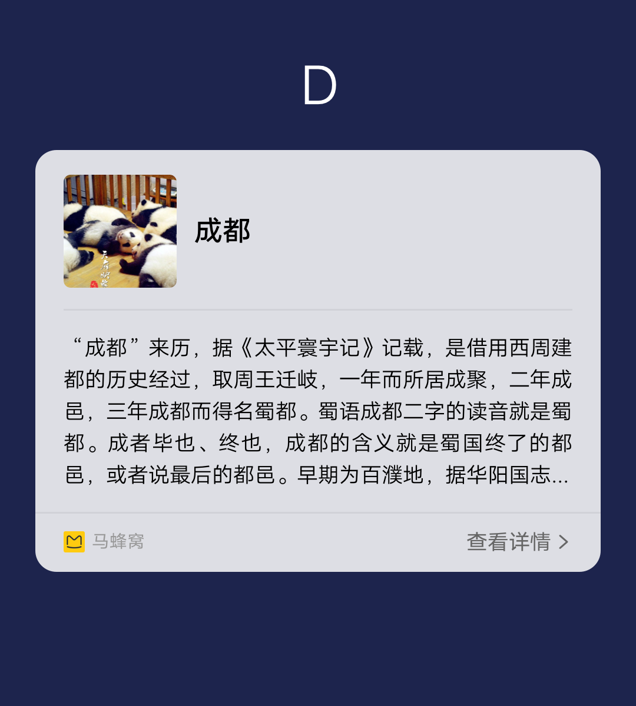
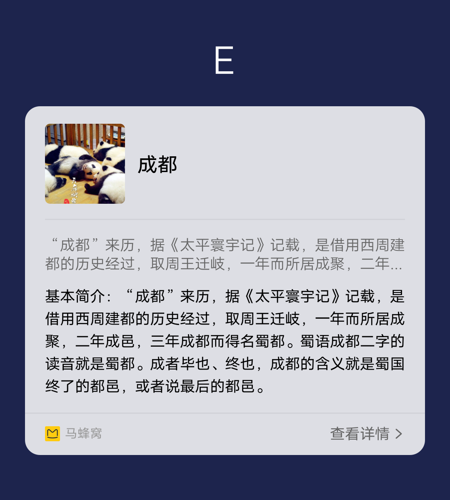
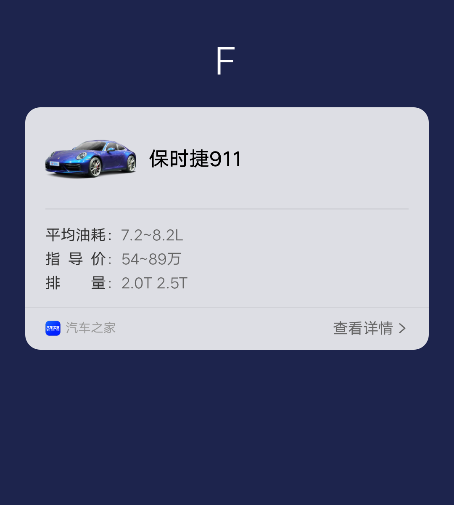
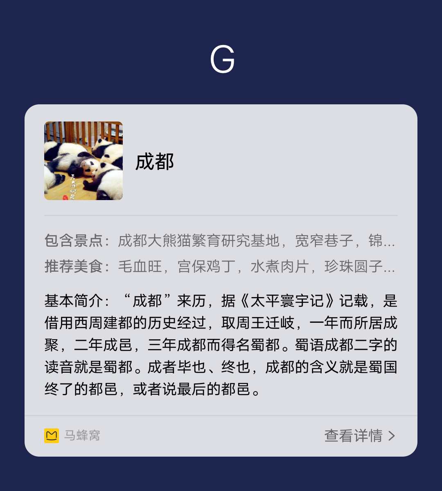
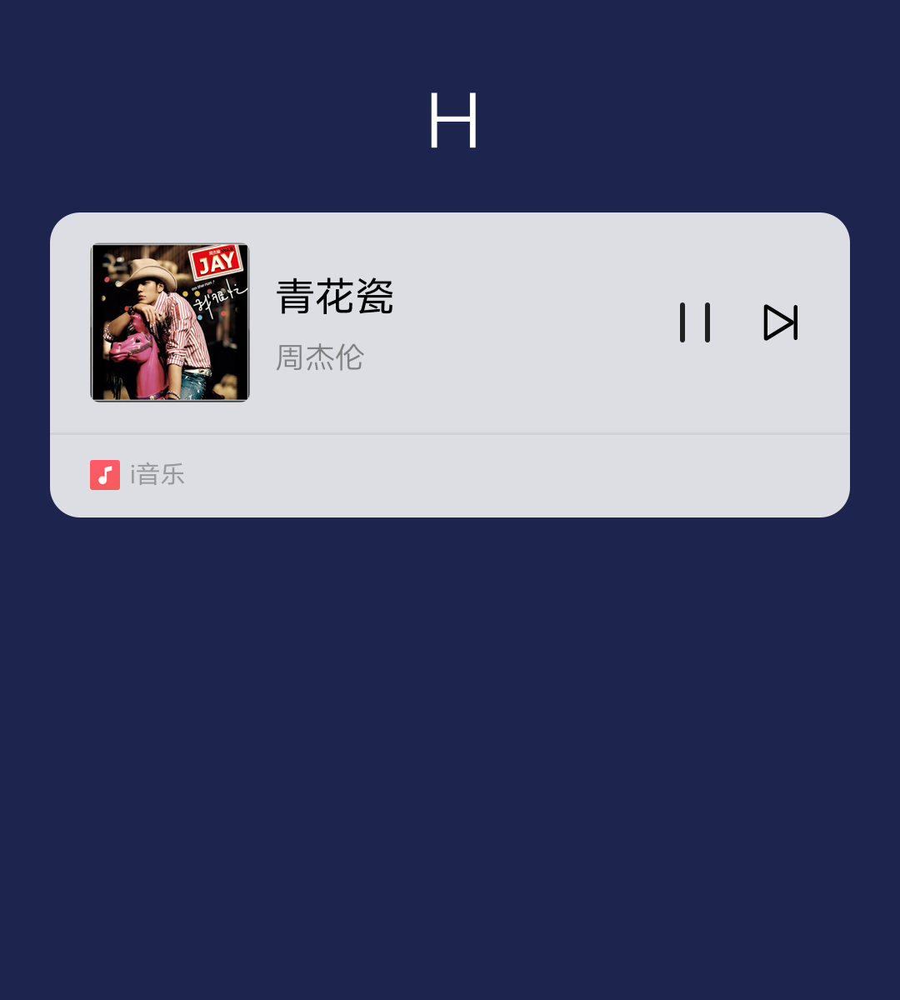

## 【模板】 卡片模板

### 描述

jovi 语音图文卡片模板

### 使用效果

<div style="text-align: center;margin: 40px;">
  
  
  
  
  
  
  
  
</div>

### 使用方法

在`.ux`文件中引入组件

```html
<import
  name="card-template"
  src="vivo-cards-suits/voice/card-template/index.ux"
></import>
```

### 示例

```html
<template>
  <div class="card">
    <card-template
      template-type="{{templateType}}"
      template-data="{{templateData}}"
      sign-name="{{signName}}"
      sign-url="{{signUrl}}"
      skip-name="{{skipName}}"
      skip-link="{{skipLink}}"
      img-type="{{imgType}}"
      img-resize-mode="{{imgResizeMode}}"
      img-object-fit="{{imgObjectFit}}"
      onclickmore="handleClickMore"
    ></card-template>
  </div>
</template>

<script>
  import router from "@system.router";

  export default {
    data() {
      return {
        templateType: "A", // A-H
        templateData: {}, // A模板数据
        signName: "来源名称",
        signUrl: "",
        skipName: "查看详情",
        skipLink: "https://www.quickapp.cn/",
        imgType: "B", // A: 144*108 B: 128*128
        imgResizeMode: "cover",
        imgObjectFit: "cover"
      };
    },
    handleClickMore() {
      console.log(`点击查看详情 url: ${this.skipLink}`);

      router.push({
        uri: this.skipLink
      });
    }
  };
</script>

<style lang="less">
  .card {
    width: 100%;
  }
</style>
```

### API

#### 组件属性

| 属性          | 类型   | 默认值     | 说明                                                   |
| ------------- | ------ | ---------- | ------------------------------------------------------ |
| templateType  | String | 'A'        | 模板类型，可选值 A-H                                   |
| templateData  | Object | {}         | 模板数据，元素属性参考对应的模板组件                   |
| signName      | String | '来源名称' | 底部来源名称                                           |
| signUrl       | String | -          | 底部 logo 地址，支持 base64                            |
| skipName      | String | '查看详情' | 底部按钮名称                                           |
| skipLink      | String | -          | 底部按钮链接                                           |
| imgType       | String | B          | 图片的尺寸类型，A: 144\*108 B: 128\*128                |
| imgResizeMode | String | 'cover'    | 图片的缩放类型：cover，contain，stretch， center       |
| imgObjectFit  | String | 'cover'    | 图片的缩放类型：contain，cover，fill，none，scale-down |
