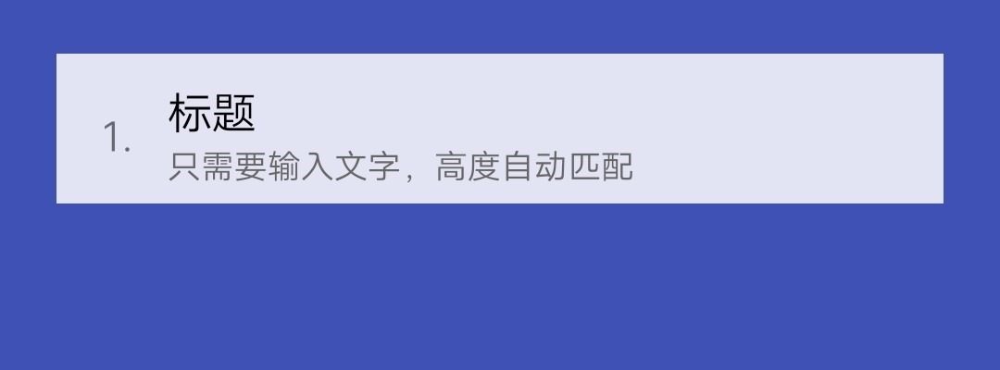

## 【组件】 文本组件 A

### 描述

序号 + 标题 + 文本

### 使用效果

<div style="text-align: center;margin: 40px;">
  
</div>

### 使用方法

在`.ux`文件中引入组件

```html
<import
  name="text-a"
  src="vivo-cards-suits/components/voice/components/text-a.ux"
></import>
```

### 示例

```html
<template>
  <div class="card">
    <text-a index="{{index}}" title="{{title}}" content="{{content}}"></text-a>
  </div>
</template>

<script>
  export default {
    data() {
      return {
        index: 1,
        title: '标题'
        content: '只需要输入文字，高度自动匹配',
      };
    },
  };
</script>

<style lang="less">
  .card {
    width: 100%;
    flex-direction: column;
  }
</style>
```

### API

#### 组件属性

| 属性    | 类型   | 默认值 | 说明     |
| ------- | ------ | ------ | -------- |
| index   | Number | -      | 序号     |
| title   | String | -      | 标题     |
| content | String | -      | 文本内容 |
